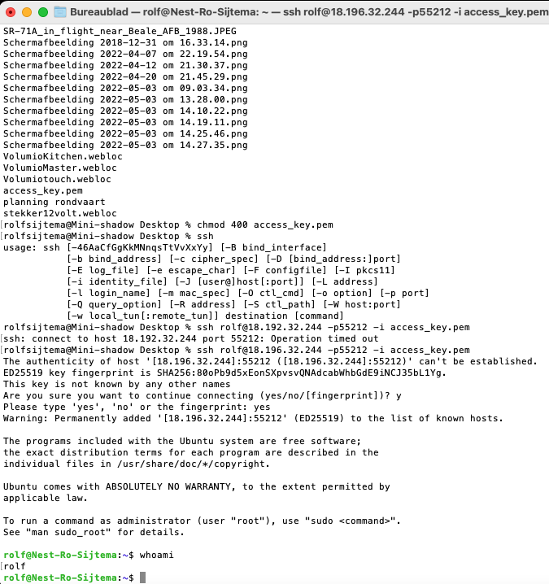

# [setting up]

During this course we will run a Linux distribution called Ubuntu. In the background there is a VM running on AWS. Within that VM we have created a container for every student. This container acts like a clean instance of Ubuntu. There is no GUI installed, so you will have to use the CLI.

## Key terminology
opzetten SSH verbinding via terminal mac os

## Exercise
Make an SSH-connection to your machine. SSH requires the key file to have specific permissions, so you might need to change those.
When the connection is successful, type whoami in the terminal. This command should show your username.

### Sources
[List your sources you used for solving the exercise]

### Overcome challanges
[Give a short description of your challanges you encountered, and how you solved them.]

### Results

