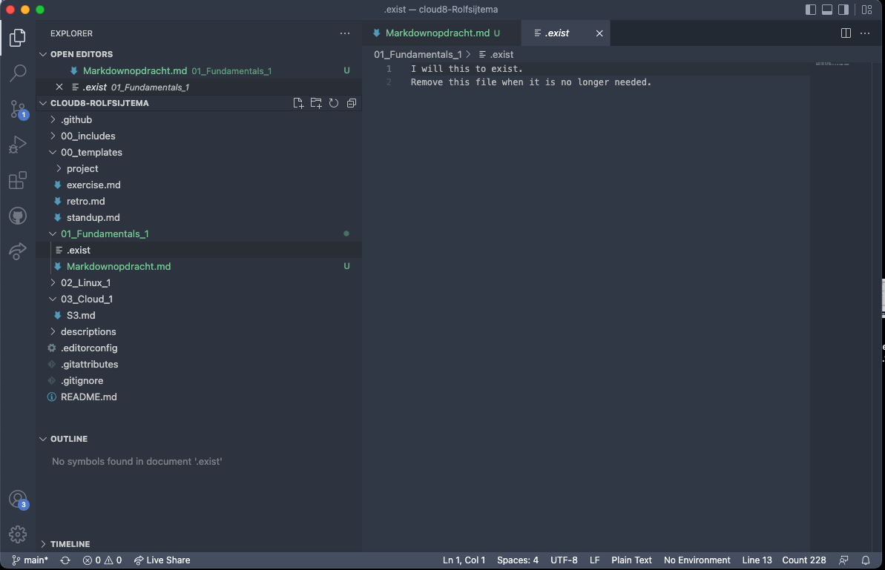
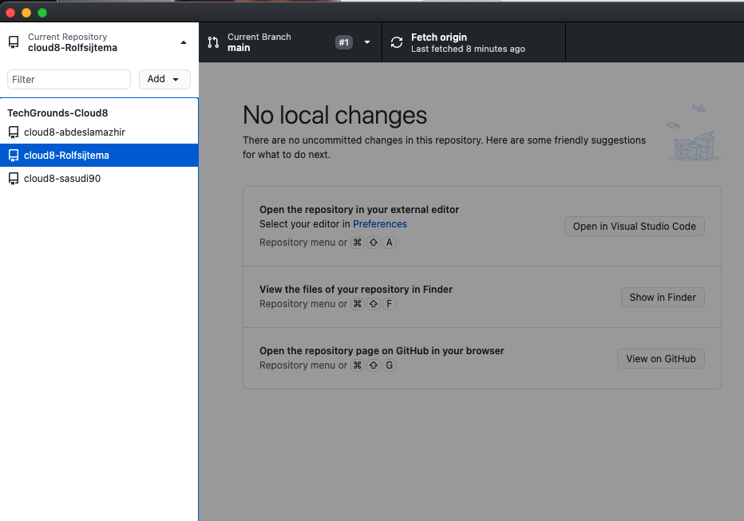
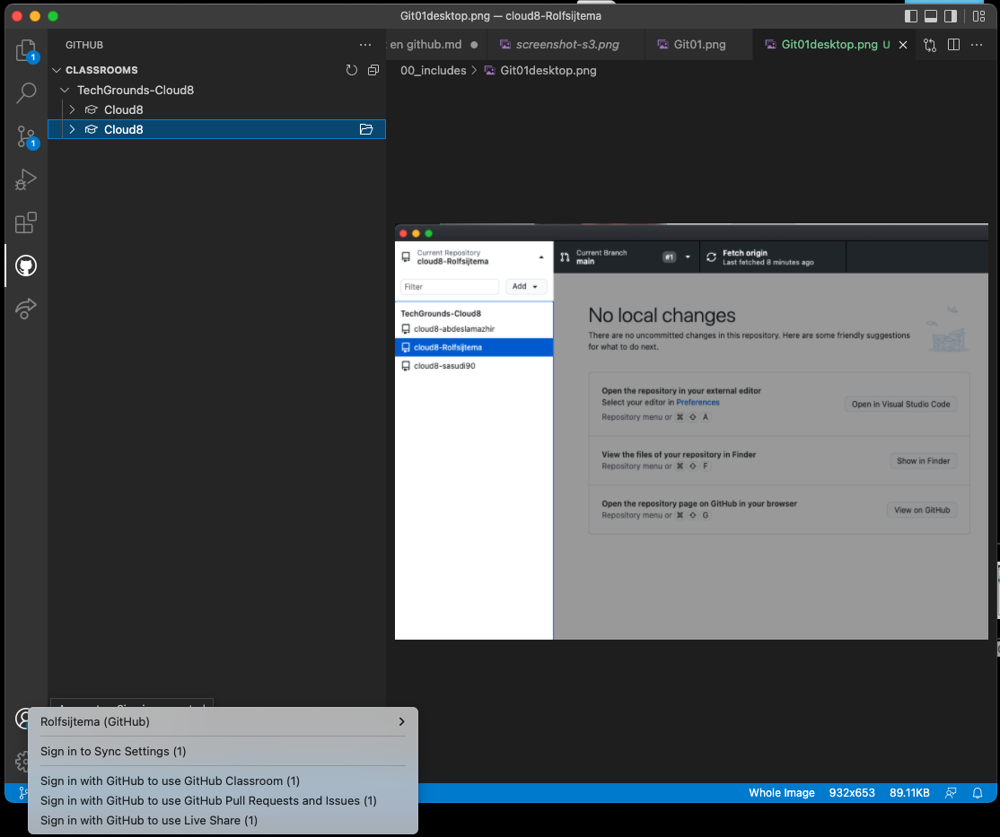
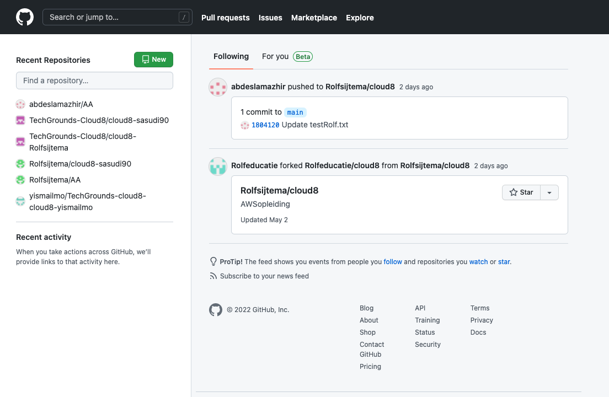
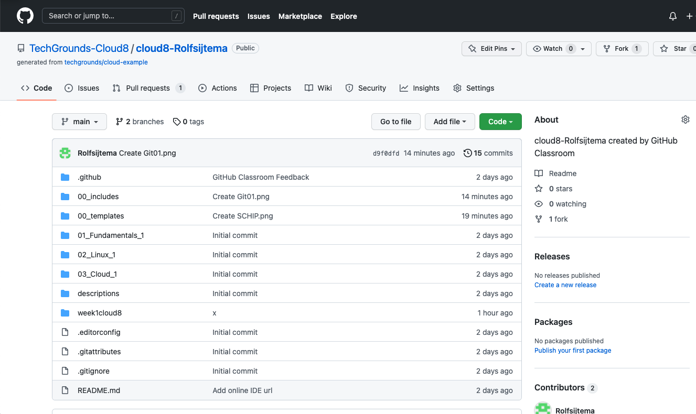

# [Git01 en Github]

What is GitHub in a nutshell?
Think of GitHub as a platform that stores the whole codebase in a remote repository. It comes with tools to collaborate on projects of any size. By enabling the creation of remote repositories, GitHub allows developers to have a unified source of truth for their source code. This is what makes open source possible.

## Key terminology
Branch – A version of the repository that diverges from the main working project
Commit - Used to record the changes in the repository.
Push / Pull - The term pull is used to receive data from GitHub. It fetches and merges changes from the remote server to your working directory. The git pull command is used to pull a repository.
Merge - A command that allows you to merge branches from Git.
Fork - A copy of a repository. Forking a repository allows you to freely experiment with changes without affecting the original project.

Repository - A central file storage location. It is used by version control systems to store multiple versions of files. While a repository can be configured on a local machine for a single user, it is often stored on a server, which can be accessed by multiple users.
Main / Master - In Git, "master" is a naming convention for a branch. After cloning (downloading) a project from a remote server, the resulting local repository has a single local branch: the so-called "master" branch. This means that "master" can be seen as a repository's "default" branch.

## Exercise

Opdracht1:
Maak een GitHub account als je er nog geen hebt
Maak een repository op je GitHub account voor je portfolio
Geef permissies aan je teamgenoten om de repository te gebruiken
Push je code naar je repository
Pull / Clone een repository van je peer.

Opdracht 2:
Maak een nieuwe repository aan voor je portfolio
Push je notities naar de repository.
Deel deze repository met je Learning Coach

### Sources
https://en.wikipedia.org/wiki/GitHub
https://github.com/
https://code.visualstudio.com/
https://www.youtube.com/watch?v=wpISo9TNjfU

### Overcome challanges
het connecten van de Github acounts van medestudenten, vorken e.d. het opschonen van overbodige reposetories naar 1 master classroom versie. foutmeldingen op macbook, later alles weer opnieuw moeten doen op een modernere mac.  Push Pull laten werken tussen de juiste omgevingen binnen Github/github desktop en browser. Ik had een clone gemaakt waardoor mijn verandereringen in VScode niet goed doorkwamen. 

### Results

