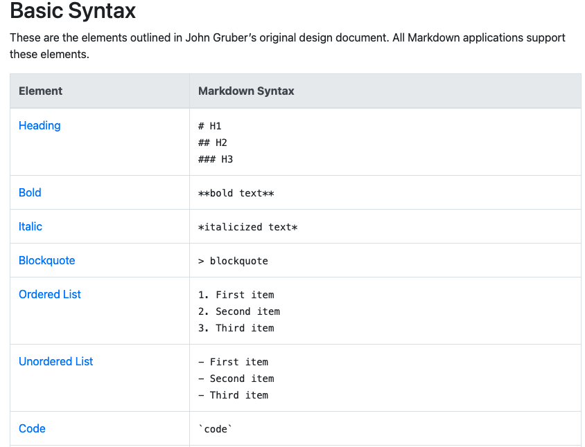

[Git Markdown]
Key terminology
Markdown - Markdown is a lightweight markup language for creating formatted text using a plain-text editor.

WYSIWYG - An acronym for What You See Is What You Get, is a system in which editing software allows content to be edited in a form that resembles its appearance when printed or displayed as a finished product

WYSIWYM - What You See Is What You Mean is a paradigm for editing a structured document. It is an adjunct to the better-known WYSIWYG (What You See Is What You Get) paradigm, which displays the result of a formatted document as it will appear on screen or in print—without showing the descriptive code underneath

Sources
https://www.youtube.com/watch?v=pTCROLZLhDM
https://www.markdownguide.org/cheat-sheet/

Overcome challanges
Markdown kun je als extension enablelen binnen in VScode. Wanneer je je tekst wilt aanpassen kan dit direct in VScode gedaan worden ipv dat je codes hekjes e.d. zelf moet gaan uittikken. 

Exercise
Voorbeeld Markdown

#  **De vloot van Asow**

##  *Een prachtig schilderij*

