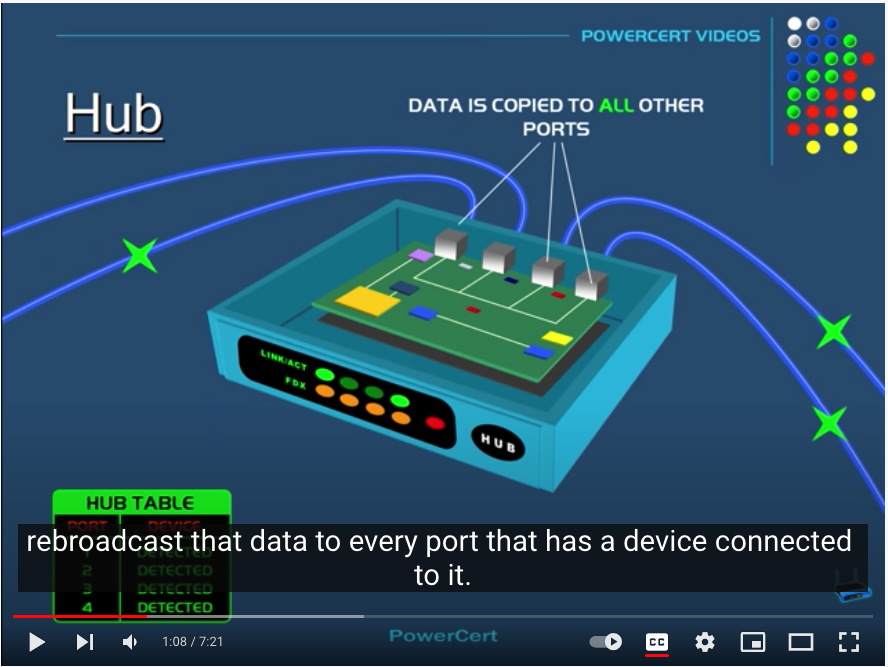

# [NWT-02 Network divces]

Equipment used for networking: 
router
switch
repeaters
access point 
HUB

## Key terminology
Networkdivices are hardware products.
OSI is the system that creates the route/data/way of communicating to the hardware and within the network.  

## Exercise
1: Study Networkdevices and The OSI model compare to you network.

2: Benoem en beschrijf de functies van veel voorkomend netwerkapparatuur
De meeste routers hebben een overzicht van alle verbonden apparaten, vind deze lijst. Welke andere informatie heeft de router over aangesloten apparatuur?
Waar staat je DHCP server op jouw netwerk? 

### Sources
Hub Switches Router diviced
https://www.youtube.com/watch?v=1z0ULvg_pW8

DHCP explained:
https://www.youtube.com/watch?v=S43CFcpOZSI

DHCP config:
https://www.youtube.com/watch?v=b_9Dg0QYJUg

### Overcome challanges
Understanding what thing or server or machine makes the DHCP work. 

### Results
Name and explain network devices: 

Hub:
A Hub receives data and copy's this data to all the other ports wich are connected. A hub is does not add or change anything to the data. A downside to a Hub is: it always sends data to all connected ports/divices even when it is not ment to do, this cost more bandwith and also costs incase of cloudnetworks. 

Swiths:
A switch looks like a HUB, except it is intelligent, it can add MAC-adresses to computers connected on the switch. Data will be only send to the "right" mac/computer adres.   HUBS and SWITCHES do NOT read IPadresses. you need a Router!

Router:
A router send and receives data pakages within or outside the home network, it can also send data to another network. It automatically receives the data ment for the home network.   All routers have there own IPadres 192.168.. and a (subnet mask) 225.225

All network devices belong to Layer 1 within OSI. 

Vind Lijst met apparaten:
Aiport Router
Airport expres1
Airport expres2
Iphone
etc..

Welke andere informatie heeft de router over aangesloten apparatuur?

The router show's MAC-adres of each connected devices within the network. 
It shows the networkname  and it's IP adres to where outside networks can connect.

(no screenshot because this is private information)

Waar staat je DHCP server op jouw netwerk?
The DHCP server is build within a Internet-server, this can be Windows server.
Dynamic Host Configuration Protocol
Also on you networkcard is a DHCP configurator.

A connected PC on the network ask for a DHCP adres from the router, without this adres the computer has no adres or connection to the internet or router.

Wat zijn de configuraties hiervan?
In a homenetwork is DHCP automatic
In big company's it could be done manually, static IP. 
IPv4 DHCP is build in ur router

ipconfig /all | find /i "dhcp server"

