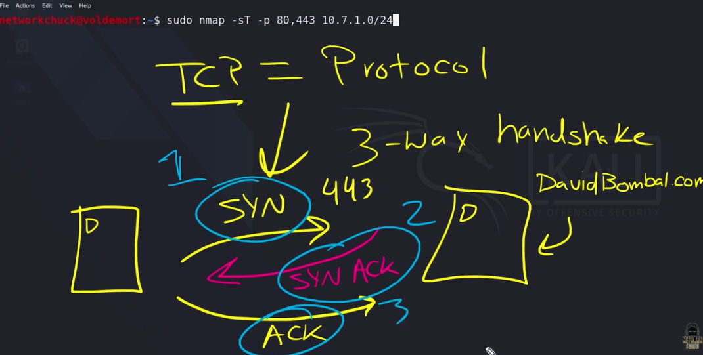
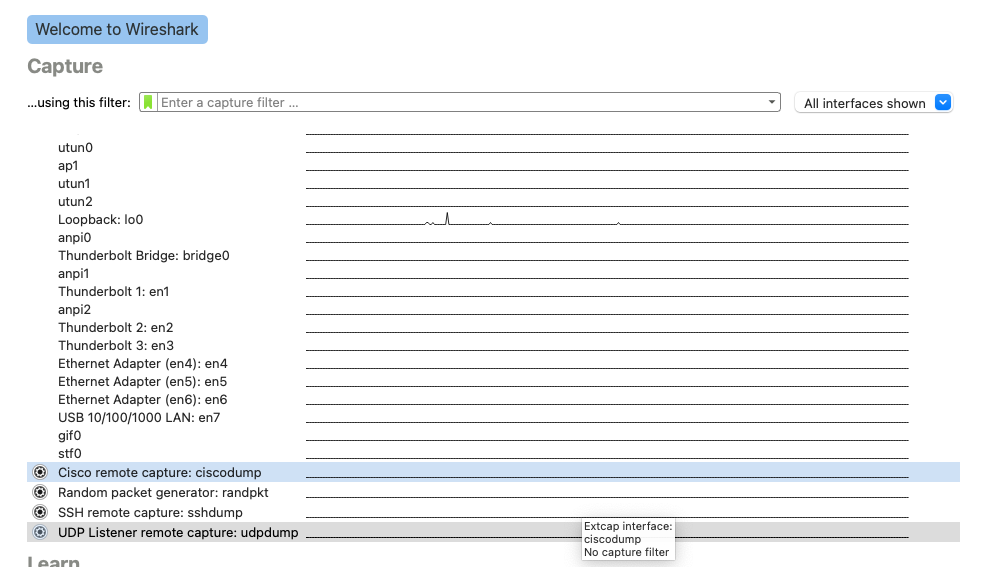
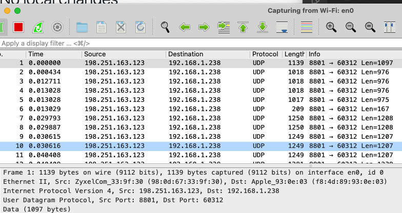
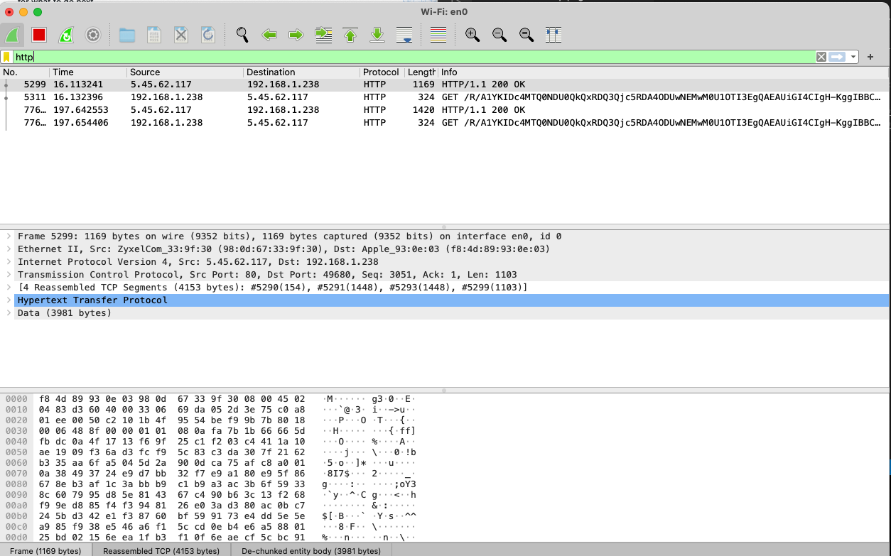

# [Protocols]
Learning about protocols, how to use wireshark and readout ur own network protocols

## Key terminology
A network protocol is a agreement, how things should be developed, if everyone build there things around these protocols it will usually work on the IT/www...
fire and forget: TCP handshake is more reliable protocol to send  data.  
UDP is much faster but less reliable. 
HTTPS  and SSH have there own portnumbers. 

3way handshake:

## Exercise
Identify several other protocols and their associated OSI layer. Name at least one for each layer.
Figure out who determines what protocols we use and what is needed to introduce your own protocol.
Look into wireshark and install this program. Try and capture a bit of your own network data. Search for a protocol you know and try to understand how it functions.

### Sources
[https://www.google.com/search?q=how+introduce+your+own+protocol&ei=IRp6YqalFsvxkwXv8aXYAQ&ved=0ahUKEwjmud6JutT3AhXL-KQKHe94CRsQ4dUDCA4&uact=5&oq=how+introduce+your+own+protocol&gs_lcp=Cgdnd3Mtd2l6EAM6BwgAEEcQsANKBAhBGABKBAhGGABQjwlY1Atg5BJoAXABeACAAVCIAZcCkgEBNJgBAKABAcgBCMABAQ&sclient=gws-wiz]

Wireshark.org to install
How to use Wireshark link: [https://www.youtube.com/watch?v=Hl0IpoS503A]

[https://www.tutorialspoint.com/what-are-the-network-protocol-requirements-in-the-communication-process]

### Overcome challanges
what is needed to make ur own protocol, difficult to find this answer. Patrick looked at this question in a diffirent way and found the excact parts that are needed. 

### Results
Installed Wireshark, and fixed the Chmod issiue by installen an update. 

Show protocols in OSI model

Who determines Internet Protocol?
The Internet Assigned Numbers Authority (IANA) coordinates the DNS, IP addressing, and other internet protocol resources. All domain names and IP addresses are allocated from IANA. Founded in the early '70s and led by John Postel, one of the fathers of the DNS, today it operates as a subsidiary organization of ICANN.

What is the need of protocol?
There are Internet Protocols, Networkprotocols
Requirements for Network Protocol
A good network protocol will meet the following requirements −
Addressing − A unique address is assigned (names can also be assigned to computers) to each computer. This address is used in the communication packet.
Data Exchange Format − Data should be formatted in well-defined packets and sent across the network. Data packet header area contains the fields with relevance to the operation of the protocol. Payload contains the message sent by the application running on the computers.
Error Recovery − Error detection is must on networks where data corruption is possible. Network protocols suggest the use of CRC to detect and recover network errors.
Routing − When systems are not directly connected, intermediary systems forward messages to the receiver. These are called routers.

Look into wireshark and install this program. Try and capture a bit of your own network data. Search for a protocol you know and try to understand how it functions.

next picture shows HTTP protocol movement on netwerk. 

