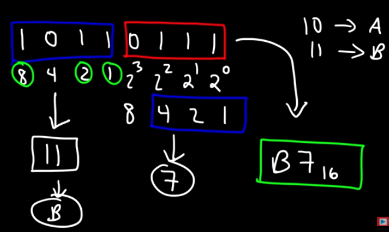
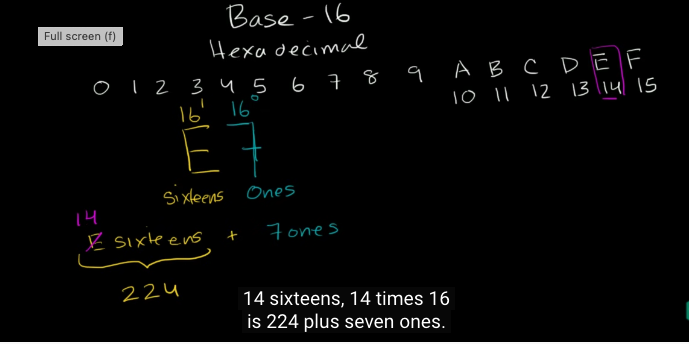

# [Counting in Binary and Hex]
Understand: Binary / hex and how it is calculated. 

## Key terminology
A binary number is a number expressed in the base-2 numeral system or binary numeral system, a method of mathematical expression which uses only two symbols: typically "0" (zero) and "1" (one).
hexadecimal (also base 16 or simply hex) numeral system is a positional numeral system that represents numbers using a radix (base) of 16.

## Exercise
understand: Counting in base 2 and base 16
try to do it manually 

### Sources
What is a binary number explained
[https://en.wikipedia.org/wiki/Binary_number]

binary expained by calculating.
[https://www.youtube.com/watch?v=Pr20m1zfuoA]

Binary to Hexadecimal explained
[https://www.youtube.com/watch?v=tSLKOKGQq0Y]

BASE 16 calculation
[https://www.youtube.com/watch?v=4EJay-6Bioo]

### Overcome challanges
Understanding the way of calculating the BASE2 or Base16, divide or multiply, after 0123456789 you get ABCDE

### Results
Counting in base 2 
Base 2 is called: Binary Numbers calculations are multiplied bij 2
You can only write a 0 or 1,  2 is no option! than you get 1-0  
1 means on and 0 means off
0 0 0 1   numerical value 20
0 0 1 0   numerical value 21
0 1 0 0   numerical value 22
1 0 0 0   numerical value 23

Base 16  
Base 16 is called the hexadecimal system 
00000000  57 69 6b 69 70 65 64 69  61 2c 20 74 68 65 20 66  
00000010  72 65 65 20 65 6e 63 79  63 6c 6f 70 65 64 69 61  
00000020  20 74 68 61 74 20 61 6e  79 6f 6e 65 20 63 61 6e 
00000030  20 65 64 69 74 0a

In the links to youtube you find an excact explanation of a base16 translation
[https://www.youtube.com/watch?v=4EJay-6Bioo]

HEX16 "number 224" "E14" explained   after 0123456789 you add: ABCDE

