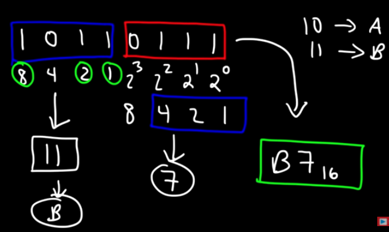

# [Counting in Binary and Hex]
Understand: Binary / hex and how it is calculated. 

## Key terminology
A binary number is a number expressed in the base-2 numeral system or binary numeral system, a method of mathematical expression which uses only two symbols: typically "0" (zero) and "1" (one).

## Exercise
understand: Counting in base 2 and base 16
try to do it manually 

### Sources
What is a binary number explained
[https://en.wikipedia.org/wiki/Binary_number]

Binary to Hexadecimal
[https://www.youtube.com/watch?v=tSLKOKGQq0Y]

### Overcome challanges
[Give a short description of your challanges you encountered, and how you solved them.]

### Results
Counting in base 2 
0 0 0 1   numerical value 20
0 0 1 0   numerical value 21
0 1 0 0   numerical value 22
1 0 0 0   numerical value 23

Base 2 is called: Binary 
calculations are multiplied bij 2

Base 16  
 
