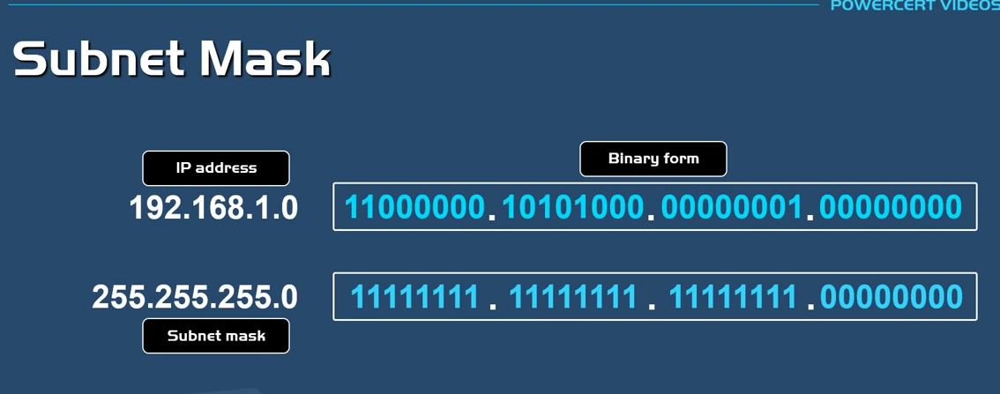
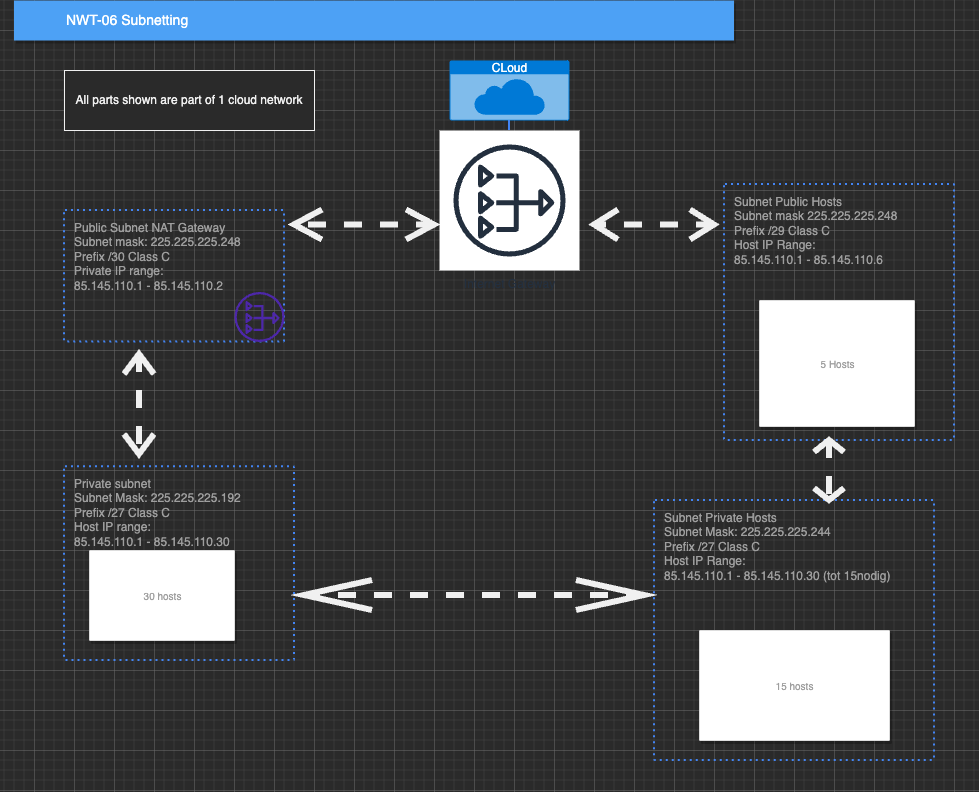

# [Subnetting]
When 2 or more divices are connected we call it a Local Area Network (LAN), every host(device) has its own adres in this range. A Subnet Mask helps to (prefix) all this adresses, how many "bits" of the networkadres are reserved for the host/devices. A subnet is a smaller network within a bigger network. the subnet has a larger prefix than the larger network it is connected to. Subnet logically isolates the devices/host. 

## Key terminology
CIDR notation: 
(Classless Inter-Domain Routing) is an alternate method of representing a subnet mask. It is simply a count of the number of network bits (bits that are set to 1) in the subnet mask. And make IPadressen available. 

Subnet and subnetmask:
SUbnetting makes it more efficient to route data
A subnet (short of subnetwork) describes the specific part of a network that shares the network’s IP address but has a unique subnet address. 
A subnet mask, however, differentiates between the portion of an IP address that refers to the subnet and the portion which refers to the host.

Prefix:
Prefix is a measurement to quantify large number. In networking, prefix is used to quantify large number of hosts/networks - 10.0.0.0/8 and 10.0.0.0/24 is a prefix. My definition of BGP Prefix is a large number of networks learned via BGP Routing Protocol.

Bits:
Image result for bits in networking
The terms bits and bytes in computer networking refer to standard units of digital data transmitted over network connections. There are 8 bits for every 1 byte.

## Exercise
Design a network with the following parts:

1 private subnet with atleast 15 hosts. Only accessable within the LAN.
1 private subnet with atleast 30 hosts (excluding NAT gateway). This network should have internet access.
1 public subnet with a internet gateway. This subnet needs to be able to place atleast 5 hosts (excluding the internet gateway)

### Sources
[https://app.diagrams.net/]
Subnet/mask/subnetting:
[https://www.ipxo.com/tutorial/what-is-subnet-mask/]
Subnet calculator
[https://www.calculator.net/ip-subnet-calculator.html?cclass=any&csubnet=30&cip=193.29.60.128&ctype=ipv4&printit=0&x=66&y=16]
Subnet explained
[https://www.youtube.com/watch?v=s_Ntt6eTn94]

### Overcome challanges
making all connections in the network by drawing, and put the IP bits right in place

### Results
The amount of subnet IPrange depends on cost or growth of the company, when its about cost take the amount that is in need. when the company is growing add more. 

Maak een netwerkarchitectuur die voldoet aan de volgende eisen:

virtual private cloud, met subnetten  private is binnen netwerk en public is bij website.  binnen je netwerk kun je aparte security groups maken, wie kan waar wel of niet in. 

1 private subnet dat alleen van binnen het LAN bereikbaar is. Dit subnet moet minimaal 15 hosts kunnen plaatsen.

1 private subnet dat internet toegang heeft via een NAT gateway. Dit subnet moet minimaal 30 hosts kunnen plaatsen (de 30 hosts is exclusief de NAT gateway).

1 public subnet met een internet gateway. Dit subnet moet minimaal 5 hosts kunnen plaatsen (de 5 hosts is exclusief de internet gateway).
Plaats de architectuur die je hebt gemaakt inclusief een korte uitleg in de Github repository die je met de learning coach hebt gedeeld.
