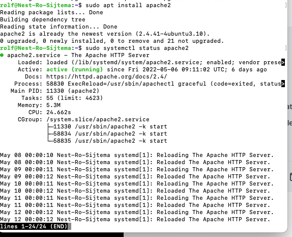
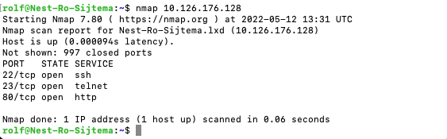
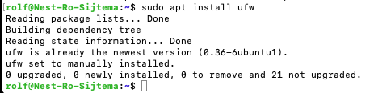
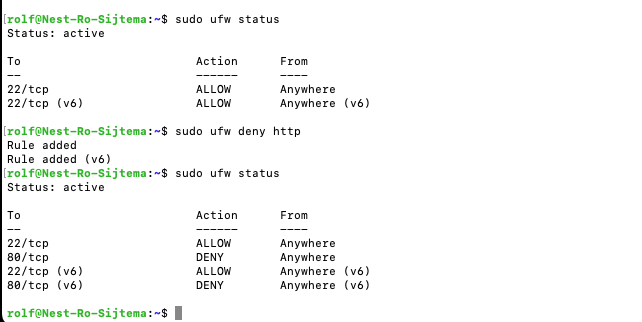

# [Firewalls]
Firewalls are ment to protect ur private network against threats from the public internet. 
A mechanism to filter out malicious traffic before it crosses the network perimeter. Firewalls are manditory!!!

## Key terminology
REHL : Red Hat Enterprise Linux
Everywhere enterprise IT is headed, Red Hat® Enterprise Linux® is there. From the public cloud to the edge, it evolves to bring flexibility and reliability to new frontiers. This is the stable foundation for untold innovation.

CentOS:
Community-driven free software effort focused around the goal of providing a rich base platform for open source communities to build upon. CentOS Linux is downstream of Red Hat Enterprise Linux—most often used for development and deployment—and doesn't have a contribution model. 

Ubuntu Firewall: UFW
The Uncomplicated Firewall (ufw) is a frontend for iptables and is particularly well-suited for host-based firewalls. ufw provides a framework for managing netfilter, as well as a command-line interface for manipulating the firewall.

Study diffirent types of Firewalls
Stateful firewalls are capable of monitoring and detecting states of all traffic on a network to track and defend based on traffic patterns and flows. 

Stateless firewalls, however, only focus on individual packets, using preset rules to filter traffic.

Hardware-based firewalls. A hardware-based firewall is an appliance that acts as a secure gateway between devices inside the network perimeter and those outside it. ...

Software-based firewalls. A software-based firewall, or host firewall, runs on a server or other device. ...
Cloud/hosted firewalls.

## Exercise
Installeer een webserver op je VM.
Apache2
Bekijk de standaardpagina die met de webserver geïnstalleerd is.
Stel de firewall zo in dat je webverkeer blokkeert, maar wel ssh-verkeer toelaat.
Controleer of de firewall zijn werk doet. 

### Sources
types of fire
[https://www.techtarget.com/searchsecurity/feature/The-five-different-types-of-firewalls]
[https://www.centos.org/][https://www.redhat.com/en/technologies/linux-platforms/enterprise-linux]
Install firewall on Linux
[https://linuxize.com/post/how-to-setup-a-firewall-with-ufw-on-ubuntu-20-04/#:~:text=Ubuntu%20ships%20with%20a%20firewall,as%20the%20name%20says%2C%20uncomplicated.]
alow ports
[https://www.digitalocean.com/community/tutorials/ufw-essentials-common-firewall-rules-and-commands]

### Overcome challanges
show apache2 standard page
and
Activate ufw 

### Results
Install webserver Linux:

NMAP 10.126.176.128/24  check ports open

Show standard page Apache2

Use ufw firewall to block-webtraffic.

Allow SSH-traffic SSH port 22 alow

Standard page Apache2 not reachable Port 80 HTTP blocked

HTTP allowed again: 

