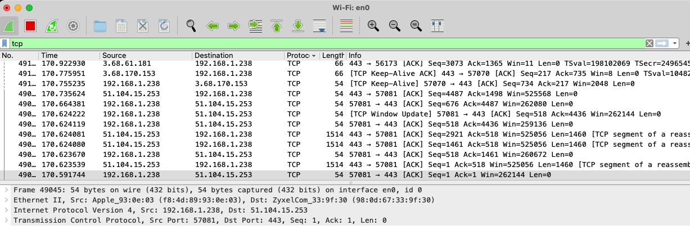

# [Sec-01 Network Detection]
Analyse your network using Nmap, and use Wireshark to find out what happends when you open your internetbrowser. 

## Key terminology
Nmap (Network Mapper)
Nmap is a network scanner created by Gordon Lyon. Nmap is used to discover hosts and services on a computer network by sending packets and analyzing the responses. Nmap provides a number of features for probing computer networks, including host discovery and service and operating system detection.

Hackers / security:
Why do hackers use Nmap?
Nmap can be used by hackers to gain access to uncontrolled ports on a system. All a hacker would need to do to successfully get into a targeted system would be to run Nmap on that system, look for vulnerabilities, and figure out how to exploit them. Hackers aren't the only people who use the software platform, however

Wireshark:
Wireshark is a network protocol analyzer, or an application that captures packets from a network connection, such as from your computer to your home office or the internet. Packet is the name given to a discrete unit of data in a typical Ethernet network. Wireshark is the most often-used packet sniffer in the world.

## Exercise
Study Nmap/Wireshark
Scan the network of your Linux machine using nmap. What do you find?

Open Wireshark in Windows/MacOS Machine. Analyse what happens when you open an internet browser. (Tip: you will find that Zoom is constantly sending packets over the network. You can either turn off Zoom for a minute, or look for the packets sent by the browser between the packets sent by Zoom.)

### Sources
Nmap torturial by NetworkChuck
https://www.youtube.com/watch?v=4t4kBkMsDbQ

### Overcome challanges
[Give a short description of your challanges you encountered, and how you solved them.]

### Results
Note: this is not a screenshot because i want to be able to edit.XX my private IPadres.

Scan network NMAP: 
rolf@Nest-Ro-xxxxx:~$ nmap 10.1xx.xxx.x
Starting Nmap 7.80 ( https://nmap.org ) at 2022-05-12 09:54 UTC
Nmap scan report for _gateway.lxd (10.126.176.1)
Host is up (0.00018s latency).
Not shown: 998 closed ports
PORT   STATE SERVICE
22/tcp open  ssh
53/tcp open  domain

Analyse what happens when you open an internet browser:
There is a connection made. 
Handshakes are made in TCP,so you can see the "ACK" between my own IP adres and the source IP.   
Wireshark filter set on TCP when this is the protocol for https.   
You can see the port used for connection
Package information

