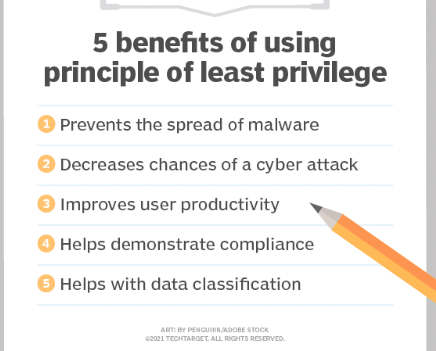

# [SEC-03 IAM]
Security goes in two steps: authentication and authorization. 
What are the diffirence between them, and how do you secure systems/information/fight fraude. 

## Key terminology

Authentication: 
This is a proces where is the person tell's who he/she is, really is who he or she is. ;) 
Do the user's credentials match the credentials in a database.

Authorization:
Authorization is the process of giving someone the ability to access a resource.
For example, user 1 can only read, user 2 may read write and Execute.  Banks use this alot to make things more secure. 

Multi-factor authentication (MFA)
Something the user knows.
Something the user has.
Something the user is.

## Exercise
The difference between authentication and authorization.

Authorization is the profile of a user, for example bankemployees have diffirent options within the software.  Employee 1 can only put in a order to buy stocks, user 2 has to check an execute this order. This is a saver way to fight against fraud.   

Authentication is for example the personal user credentials that every employee has to fill in, in order to prove it is him/her, also hardware like a card may be put in a keyboard to acces the computer login. Also apps, sms, etc...

The three factors of authentication and how MFA improves security.

Something the user knows: Passwords, Pincodes, Secret question/answer:  who is your favorite teacher? Answer: Caspar

Something the user has:
Google Authenticator (an app on your phone).
SMS text message with a code.
Soft token (also called software token).
Hard token (also called hardware token).
Security badge.

Something the user is:
A biometric verification (or something the user is) is a way to identify a person using their unique biological traits.

Fingerprints
Face reconizing
Palmprint
Voice
Retina and iris patterns
Signature
DNA

What the principle of least privilege is and how it improves security.
The principle of least privilege (POLP) is a concept in computer security.
USer get only acces to things they need to see in order to do there job. ALso departments are separated, for example Orderdepartment and Operational departments are separated in order to prevent fraude. you always need atleast 1 2 or 3 people to execute something.

Users are granted permission to read, write or execute only.

### Sources

[explanation](https://www.perforce.com/blog/vcs/what-is-multi-factor-authentication)

### Overcome challanges
None

### Results
POLP
