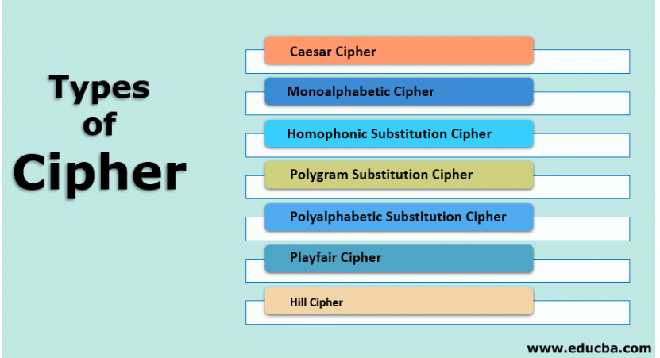

# [Symmetric encryption]

In this excercise we learn about:
A Encryption is an important tool for securing data. 
Many thing you do on the internet is encrypted. 
We speak about data at rest or Data in Motion.  
We learn about the Caesar cipher.
Data encryption is a way of translating data from plaintext (unencrypted) to ciphertext (encrypted). 

## Key terminology
cryptography: This is the study of secure communications techniques. 
Symmetric encryption: uses a single key to encrypt and decrypt. This is the simplest kind of encryption that involves only one secret key to cipher and decipher information.

Cyphers to encode: 

Data in rest Data in Motion:

## Exercise
Find two more historic ciphers besides the Caesar cipher.

Find two digital ciphers that are being used today.

Send a symmetrically encrypted message to one of your peers via the public Slack channel. They should be able to decrypt the message using a key you share with them. Try to think of a way to share this encryption key without revealing it to everyone. 
You are not allowed to use any private messages or other communication channels besides Slack. Analyse the shortcomings of this method.

### Sources
[Symmatric Encryption](https://www.ssl2buy.com/wiki/symmetric-vs-asymmetric-encryption-what-are-differences)

[cyphers](https://www.educba.com/types-of-cipher/)

### Overcome challanges
[Give a short description of your challanges you encountered, and how you solved them.]

### Results
[Describe here the result of the exercise. An image can speak more than a thousand words, include one when this wisdom applies.]
