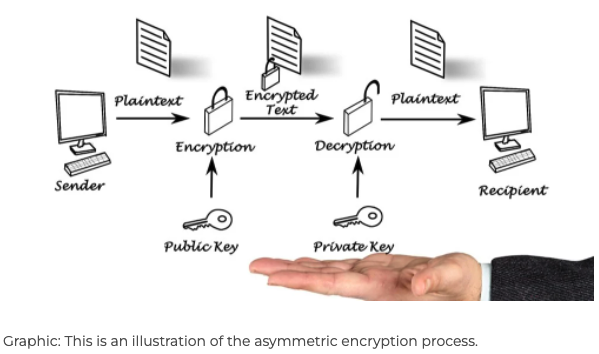
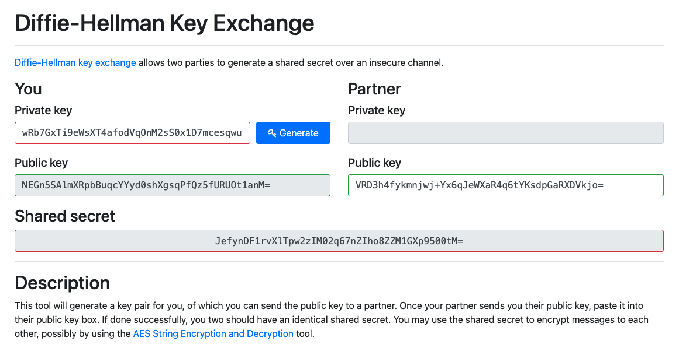

# [Asymmatric Encryption]
Learning about the Asymmatrical way of encrypting, compare is to Symmatrical. How and when to use this option. 
Learn about diffirent types of keys that are Generated

## Key terminology
Asymmetric encryption: 
Uses a mathemattically related pair of keys, encryption and de-cryption. Example of a Asymm/Encryptionis  Rivest Shamir Adleman (RSA)

A public key: 
Two keys are used 1 key is used for encryption and 1 key for decryption.

A private key:
One key is used for encrypt the plain text to convert it into cipher text and another key (private key) is used by receiver to decrypt the cipher text to read the message.

## Exercise
Generate a key pair.
Send an asymmetrically encrypted message to one of your peers via the public Slack channel. They should be able to decrypt the message using a key you share with them. The recipient should be able to read the message, but it should remain a secret to everyone else.
You are not allowed to use any private messages or other communication channels besides Slack. 

Analyse the difference between this method and symmetric encryption.

Image result for Analyse the difference between this method and symmetric encryption.
Unlike symmetric encryption, which uses the same secret key to encrypt and decrypt sensitive information, asymmetric encryption, also known as public-key cryptography or public-key encryption, uses mathematically linked public- and private-key pairs to encrypt and decrypt senders' and recipients' sensitive data

Result: 
The Diffy Hellman is the way to share messages in a public channel, this because the person needs to make a personal key together with my key and this way we make an shared acceskey to acces and read the text data message. 

### Sources
[Asymmatrical encryption](https://www.google.com/search?q=asymmetrical+encryption&ei=z1aDYsf_KZn_kwXZy5XgAg&ved=0ahUKEwiHo4qbieb3AhWZ_6QKHdllBSwQ4dUDCA4&uact=5&oq=asymmetrical+encryption&gs_lcp=Cgdnd3Mtd2l6EAMyBAgAEEMyBAgAEAoyBAgAEAoyBAgAEAoyBAgAEEMyBAgAEAoyBAgAEAoyBAgAEAoyBAgAEAoyBAgAEAo6BwgAEEcQsAM6BwgAELADEEM6CwguEIAEEMcBEKMCOgUIABCABDoLCC4QgAQQxwEQ0QM6BQguEIAEOgUIABCRAjoECC4QQzoHCAAQgAQQCkoECEEYAEoECEYYAFDYC1iPNWDkNmgDcAF4AIABggGIAcENkgEEMjIuMZgBAKABAcgBCsABAQ&sclient=gws-wiz)

[Private public key explained](https://www.google.com/search?q=public+key+private+key&ei=E1aDYsfNLaiCi-gPg6WEsA0&ved=0ahUKEwiHo7vBiOb3AhUowQIHHYMSAdYQ4dUDCA4&uact=5&oq=public+key+private+key&gs_lcp=Cgdnd3Mtd2l6EAMyBQgAEIAEMgUIABCABDIFCAAQgAQyBQgAEIAEMgUIABCABDIFCAAQgAQyBQgAEIAEMgUIABCABDIFCAAQgAQyBQgAEIAEOgcIABBHELADOgcIABCwAxBDOgQIABBDOgUILhCABDoLCC4QgAQQxwEQowI6DgguEIAEEMcBEK8BENQCOgsILhCABBDHARCvAToHCAAQgAQQCjoECAAQCjoHCC4Q1AIQCjoNCC4QxwEQrwEQ1AIQCjoICC4QgAQQ1AI6CwguEIAEEMcBENEDOgUIABCRAkoECEEYAEoECEYYAFCcCVjwfmCTgAFoCXABeACAAY0BiAGfDpIBBDIxLjOYAQCgAQGwAQDIAQrAAQE&sclient=gws-wiz)

[Diffy Hellman](https://cryptotools.net/dhe)

### Overcome challanges
Trying to avoid going to deep into the solution. 
### Results
The Diffy Hellman Methode

Result shared message

