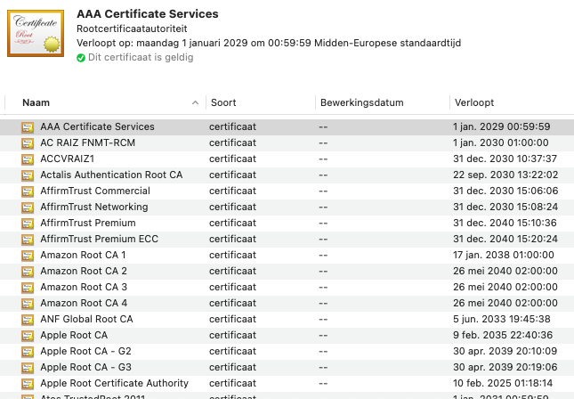
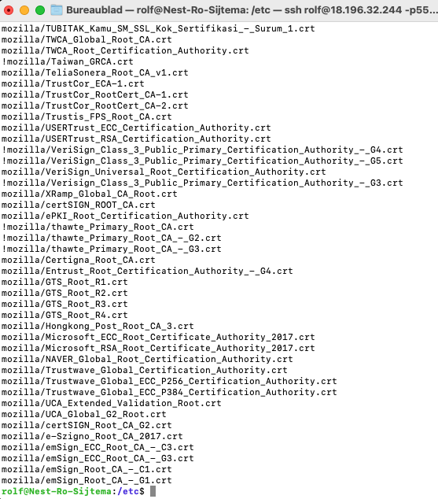

# [Public Key Infrastructure]
Learn to create self signed Certificate on a VM with linux. 
What are the three entities, learn about key infrasrtuctures roles, Hardware, software store use revoke.

## Key terminology
Public Key Infrastructure (PKI)
Is the set of hardware, software, policies, processes, and procedures required to create, manage, distribute, use, store, and revoke digital certificates and public-keys.

public-key encryption.
PKI performs encryption directly through the keys that it generates. It works by using two different cryptographic keys: a public key and a private key. Whether these keys are public or private, they encrypt and decrypt secure data.

It consists of three entities
Sign: Issuing a new certificate, based on a Certificate Signing Request (CSR).
Fetch: Recovering an existing certificate and key pair.
Revoke: Revoking a client certificate.

X.509 certificate: This is a standard: Certificate that uses the widely accepted international X. 509 public key infrastructure (PKI):
It checks  It belongs to a User, Computer, or a service.. x509 used to manage identity and security in internet communications and computer networking.

## Exercise
Create a self-signed certificate on your VM. (see result)

Analyze some certification paths of known websites (ex. techgrounds.nl / google.com / ing.nl).

Find the list of trusted certificate roots on your system (bonus points if you also find it in your VM).

### Sources
[CIA triangle](https://www.youtube.com/watch?v=o9JGsIMNq5o)

[pki explained](https://www.youtube.com/watch?v=Z4wMVf0M8-g)

[linux x509](https://devopscube.com/create-self-signed-certificates-openssl/)
 
### Overcome challanges
[Give a short description of your challanges you encountered, and how you solved them.]

### Results
Create a self-signed certificate on your VM.

SHA-256 is the type of encrypton that is used for creating the key. 

X509 creates a a selfsigned certificate using openSSL

Analyze some certification paths of known websites (ex. techgrounds.nl / google.com / ing.nl)

Details show when this certificate expires, where is it made, by who it is made, SHA-256 shows the certificate, RSA encryption. 

Find the list of trusted certificate roots on your system (bonus points if you also find it in your VM).

(bonus points if you also find it in your VM).

