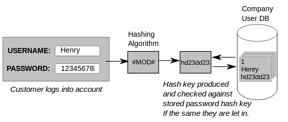
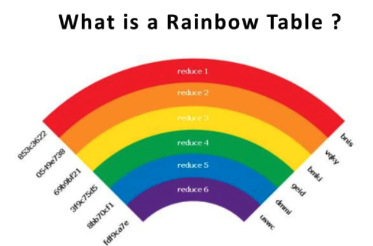
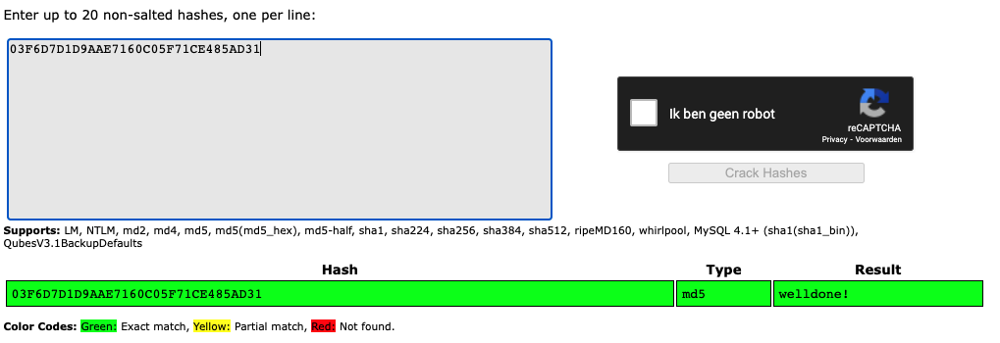
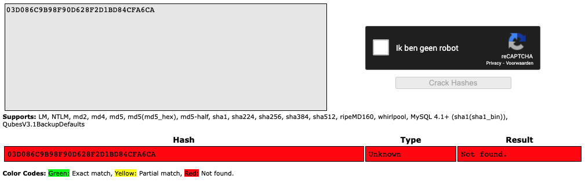
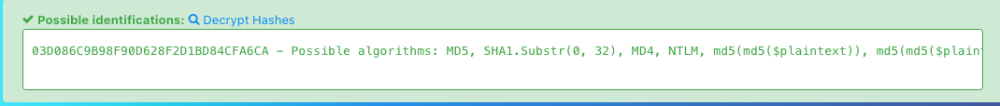
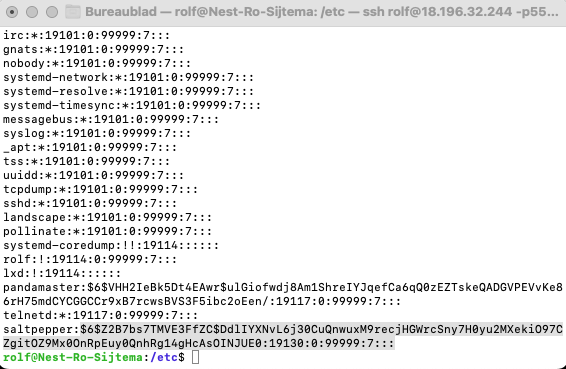
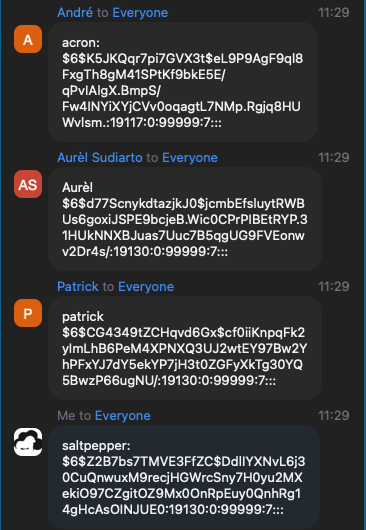

# [Passwords]
Passwords are sensitive because people can "guess" them. Make sure you make them difficult to guess.

examples of difficulty:
- Not using common passwords
	- Using longer passwords
	- Using special characters like @,*,%, etc.
	- Using a mixture of CAPITAL and small letters
	- Not using easily deducible passwords like birthdates or pet names
	- Using a different password for every login
	- Using a sentence

Downside to this is, you also make it harder for urself to remember. In order to help with this there are: Password managers, most passwords are stored "hashed"

## Key terminology
Hashed stored:
Password hashing is used to verify the integrity of your password, sent during login, against the stored hash so that your actual password never has to be stored. 

Rainbow Table: 
Hackers use: Rainbow tables, these are tables of reversed hashes used to crack password hashes. They try to crack the hashed algorithm.

SALT: 
When a password is created, SALT adds another part to it, this part contains weird caracters. Look at the picture: after this add, the hash will be made.  Rainbow tables are useless when SALT is added. 

Pepper:
Pepper is another Capital Letter that is added but will not be stored, so it will take 52 attempts to find the password. Usually you have only 3 attempts before password has to be renewed. 

## Exercise
Find out what hashing is and why it is preferred over symmetric encryption for storing passwords.

* Hashing gives a more secure and adjustable method of retrieving data compared to any other data   structure.
* Hashing helps to avoid duplication of data stored in databases.
* It is easy to find a record when the data is hashed.
* password can be recovered in a fraction of a second.

Find out how a Rainbow Table can be used to crack hashed passwords.

Below are two MD5 password hashes. One is a weak password, the other is a string of 16 randomly 
generated characters. Try to look up both hashes in a Rainbow Table.
03F6D7D1D9AAE7160C05F71CE485AD31 
Welldone

03D086C9B98F90D628F2D1BD84CFA6CA

Create a new user in Linux with the password 12345. Look up the hash in a Rainbow Table.
Despite the bad password, and the fact that Linux uses common hashing algorithms, you won’t get a match in the Rainbow Table. This is because the password is salted. To understand how salting works, find a peer who has the same password in /etc/shadow, and compare hashes.

### Sources
[hashing](https://www.ssl2buy.com/wiki/difference-between-hashing-and-encryption)

[unlead hashes](https://hashes.com/en/tools/hash_identifier)

[SALT&PEPPER](https://www.youtube.com/watch?v=--tnZMuoK3E)

### Overcome challanges
How to crack second code with Rainbow. 

### Results
Hash-code1:03F6D7D1D9AAE7160C05F71CE485AD31

Hash-code2 03D086C9B98F90D628F2D1BD84CFA6CA
The Hashed pasword does not match the database of 190GB, this could mean that there is used a SALT 

Create a new user in Linux with the password 12345. Look up the hash in a Rainbow Table.

Root: sudo useradd saltpepper

Root: sudo passwd saltpepper
cd etc
etc$ sudo cat shadow

Despite the bad password, and the fact that Linux uses common hashing algorithms, you won’t get a match in the Rainbow Table. This is because the password is salted. 

To understand how salting works, find a peer who has the same password in /etc/shadow, and compare hashes.

When a password is created, SALT adds another part to it, this part contains weird caracters. Look at the picture: after this add, the hash will be made. Rainbow tables are useless when SALT is added.

Compared Hashes: The length of the hashes are diffirent. dollar $6 is used in all SALT's

