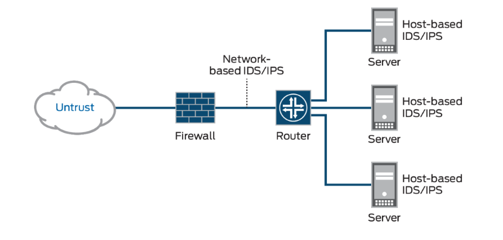
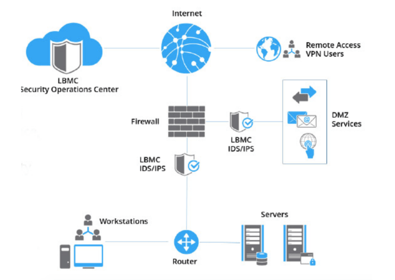

# [Detection, response and analysis]

When a attack has been occurd to ur system, the first thing you do is contain the damage. This can be done in different ways.  IDS and IPS are systems that help in this case.  Find out the root cause of the attack so you may stop it.  after you can try to recover and restart all systems. 

After the attack, you should learn from it, and also register every valueble information. 

It is vitally important to have a plan in place for how to respond when an attack happens.!!!

Keep ur systems up-to-date. 

## Key terminology
 
Social engineering: is a term that encompasses a broad spectrum of malicious activity.

examples
Phishing. ...
Vishing and Smishing. ...
Pretexting. ...
Baiting. ...
Tailgating and Piggybacking. ...
Quid Pro Quo. ...
Cyber Threats Beyond Social Engineering.
malicious software (malware)

Detection, response, and analysis.

Detecting anomalies
What are 4 methods of threat detection?

Configuration
Modeling
Indicator
Threat Behavior.

Generally, all threat detection falls into these 4 major categories: There is no best type of threat detection. Each category can support different requirements and approaches depending on the business requirement.

intrusion prevention systems (IPS)
Intrusion detection systems (IDS)

IDS and IPS constantly watch your network, identifying possible incidents and logging information about them, stopping the incidents, and reporting them to security administrators.

They work together: they analize traffic. 

If an attack is detected, the IDS reports the attack, but it is then up to the administrator to take action. That's why having both an IDS and IPS system is critical. A good security strategy is to have them work together as a

How much data is lost on incident (Recovery Point Objective; RPO), how long it takes to be back online (Recovery Time Objective; RTO), and cost.

RPO 

RTO

## Exercise
A Company makes daily backups of their database. The database is automatically recovered when a failure happens using the most recent available backup. The recovery happens on a different physical machine than the original database, and the entire process takes about 15 minutes. What is the RPO of the database?

An automatic failover to a backup web server has been configured for a website. Because the backup has to be powered on first and has to pull the newest version of the website from GitHub, the process takes about 8 minutes. What is the RTO of the website?

### Sources

### Overcome challanges
[Give a short description of your challanges you encountered, and how you solved them.]

### Results
[Describe here the result of the exercise. An image can speak more than a thousand words, include one when this wisdom applies.]
