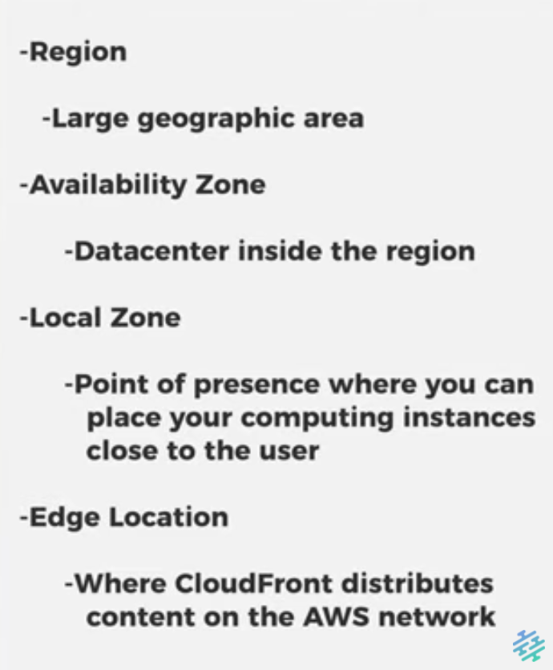

# [AWS Global INfrastructure]
AWS provides a virtual server and network. You don't have to worry about physical infra.  Aldo it is vitrual, it is important where al this is located. 

## Key terminology

Region: Physical Locations around the globe.

AZ: Availability Zone 

EL: Ede Location

IAM: AWS Identity and Access Management

Amazon RDS: Amazon Relational Database Service (a web service that that allows you to quickly create a relational database instance in the cloud)

## Exercise

Study
What is an AWS Availability Zone?

What is a Region?

What is an Edge Location?

Why would you choose one region over another? (e.g. eu-central-1 (Frankfurt) over us-west-2 (Oregon)).

### Sources
[diffirence AZ & EL](https://www.google.com/search?q=What+are+edge+locations%3F&sa=X&ved=2ahUKEwikqq7Gj_X3AhVN16QKHbuFDewQzmd6BAgREAU&biw=974&bih=825&dpr=1)

[AWS & pricing in 10min](https://www.youtube.com/watch?v=r4YIdn2eTm4)

[AWS EL AZ AR](https://www.youtube.com/watch?v=Uk2A9-JO-_w)

### Overcome challanges
[Give a short description of your challanges you encountered, and how you solved them.]

### Results

What is an AWS Availability Zone?

An availability zone is a logical data center in a region available for use by any AWS customer.
The AWS Cloud spans 84 Availability Zones within 26 geographic regions around the world, with announced plans for 24 more Availability Zones and 8 more AWS Regions in Australia, Canada, India, Israel, New Zealand, Spain, Switzerland, and United Arab Emirates (UAE).

What is a Region?

Regions in AWS: Physical locations around the world. These are locations where AWS clusters data centers.

AWS Global Infrastructure Map

What is the difference between regions and availability zones?
Each Region is a separate geographic area. Availability Zones are multiple, isolated locations within each Region.

What is an Edge Location?

Edge Locations:
An edge location is where end users access services located at AWS, the cloud computing division of US-headquartered Amazon.
They are located in most of the major cities around the world and are specifically used by CloudFront (CDN) to distribute content to end users to reduce latency.

Edge Locations (EL) and Availability Zones (AZ) are AWS Data Centers
Edge Locations: EL are primarily used for caching of the data to provide better user experience with low latency.

Availability Zones (AZ) 
AZ are used for hosting servers, websites, applications, softwares, Big Data processing, analytics and a wide variety of use cases.

Why would you choose one region over another? (e.g. eu-central-1 (Frankfurt) over us-west-2 (Oregon)).

There is region specific pricing. 
Oregon and Virginia are the cheapest regions. 

Down side: more latency when ur located further away from a server. 

