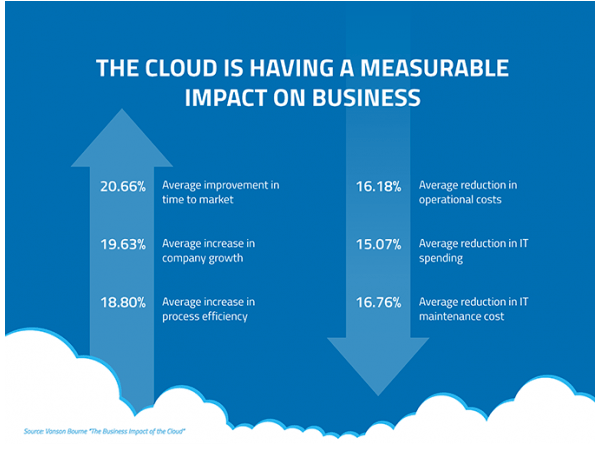

# [6 Advantages of the cloud]

Learn about the 6 advantages of cloud computing, as marketing tools. 

These 6 basic characteristics of the cloud make it interesting for company's migrate. 

You should be able to explain all six points, as well as recognise synonyms.  

## Key terminology

**Trade Capital (capEx) expense for variable expense (opex)** – Instead of having to invest heavily in data centers and servers before you know how you’re going to use them, you can pay only when you consume computing resources, and pay only for how much you consume.

**Benefit from massive economies** of scale – By using cloud computing, you can achieve a lower variable cost than you can get on your own. Because usage from hundreds of thousands of customers is aggregated in the cloud, providers such as AWS can achieve higher economies of scale, which translates into lower pay as-you-go prices.

**Stop guessing capacity** – Eliminate guessing on your infrastructure capacity needs. When you make a capacity decision prior to deploying an application, you often end up either sitting on expensive idle resources or dealing with limited capacity. With cloud computing, these problems go away. You can access as much or as little capacity as you need, and scale up and down as required with only a few minutes’ notice.

**Increase speed and agility** – In a cloud computing environment, new IT resources are only a click away, which means that you reduce the time to make those resources available to your developers from weeks to just minutes. This results in a dramatic increase in agility for the organization, since the cost and time it takes to experiment and develop is significantly lower.

**Stop spending money running and maintaining data centers** – Focus on projects that differentiate your business, not the infrastructure. Cloud computing lets you focus on your own customers, rather than on the heavy lifting of racking, stacking, and powering servers.

**Go global in minutes** – Easily deploy your application in multiple regions around the world with just a few clicks. This means you can provide lower latency and a better experience for your customers at minimal cost.

## Exercise
The six advantages of cloud computing.

You should be able to explain all six points, as well as recognise synonyms.  

### Sources

[AWS 6 advantages explained](https://docs.aws.amazon.com/whitepapers/latest/aws-overview/six-advantages-of-cloud-computing.html)

[Youtube explaination](https://www.youtube.com/watch?v=b4OGEu449l0)

### Overcome challanges
None

### Results

At the Key Terminology you find the 6 explained. 

The Synonyms / unique sellingpoints as i call them:

Here you find a picture that actually shows improvements when using cloud! 

- Save on Hardware
- save time and money on developement
- you can use ur FTE on diffirent projects
- use a service that is used worldwide
- It is brought to you by Amazon ;)
- Worldwide customers are serviced faster by low latency. 
- Easy to setup worldwide customer relation manager
- clear calculation on costs
- Use highspeed systems
- Use the latest technology
- automated updates

