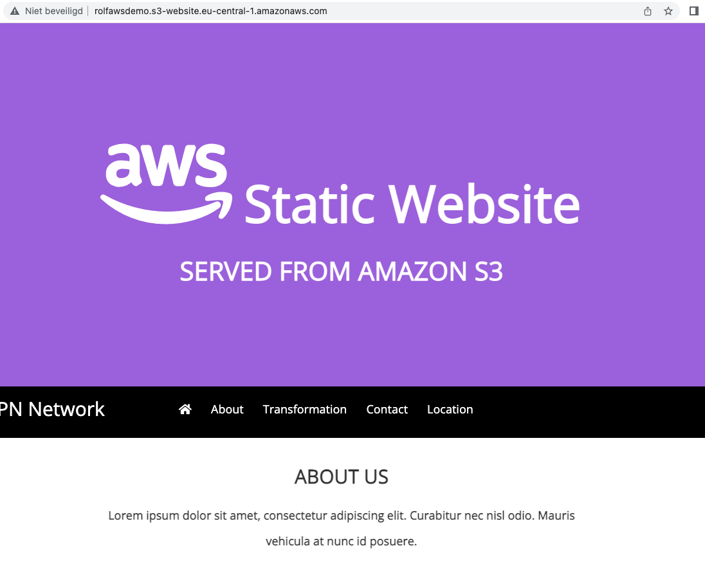

# [Simple Storage Service]

Learn about S3 services, storage classes, Glacier deep Archive, Pricing, 

Build buckets, fill them with data, give acces and share with other peers. Be aware of acces "public" 

What do you pay for in S3?
- GB storage per month
- Transfer OUT to out of the region

You don’t pay for:
- Transfer IN to Amazon S3
- Transfer OUT from S3 to CloudFront or EC2 in the same region

## Key terminology

There are 4 storage classes:
Storage classes differ in availability, durability, retrieval time, and cost.

**S3 Standard**
- Low latency and high throughput performance
Designed for durability of 99.999999999% of objects across multiple Availability Zones
- Resilient against events that impact an entire Availability Zone
- Designed for 99.99% availability over a given year
Backed with the Amazon S3 Service Level Agreement for availability
- Supports SSL for data in transit and encryption of data at rest
- S3 Lifecycle management for automatic migration of objects to other S3 Storage Classes  

**S3 Standard-IA**

- Same low latency and high throughput performance of S3 Standard
- Designed for durability of 99.999999999% of objects across multiple Availability Zones
- Resilient against events that impact an entire Availability Zone
- Data is resilient in the event of one entire Availability Zone destruction
- Designed for 99.9% availability over a given year
- Backed with the Amazon S3 Service Level Agreement for availability
- Supports SSL for data in transit and encryption of data at rest
- S3 Lifecycle management for automatic migration of objects to other S3 Storage Classes

**S3 One-zone IA**

- Same low latency and high throughput performance of S3 Standard
- Designed for durability of 99.999999999% of objects in a single Availability Zone†
- Designed for 99.5% availability over a given year
- Backed with the Amazon S3 Service Level Agreement for availability
- Supports SSL for data in transit and encryption of data at rest
- S3 Lifecycle management for automatic migration of objects to other S3 Storage Classes

**S3 Glacier**

There’s also S3 Glacier Deep archive, a subclass of S3 Glacier. And Intelligent Tiering which is more a cost optimization tool than a class on its own.

- Designed for durability of 99.999999999% of objects across multiple Availability Zones
- Lowest cost storage class designed for long-term retention of data that will be retained for 7-10 years
- Ideal alternative to magnetic tape libraries
- Retrieval time within 12 hours
- S3 PUT API for direct uploads to S3 Glacier Deep Archive, and S3 Lifecycle management for automatic migration of objects

## Exercise
Exercise 1
Create new S3 bucket with the following requirements:
Region: Frankfurt (eu-central-1)
Upload a cat picture to your bucket.
Share the object URL of your cat picture with a peer. Make sure they are able to see the picture.

Exercise 2
Create new bucket with the following requirements:
Region: Frankfurt (eu-central-1)
Upload the four files that make up AWS’ demo website.
Enable static website hosting.
Share the bucket website endpoint with a peer. Make sure they are able to see the website.

### Sources
[AWS console solutions](https://eu-central-1.console.aws.amazon.com/console/home?region=eu-central-1#)

[S3 storageclasses](https://aws.amazon.com/s3/storage-classes/)

### Overcome challanges
Finding the solution to share expercise 2 website,  make it accesable
### Results

**Exercise 1**

Result:

**Exercise 2**
 
Result: 

