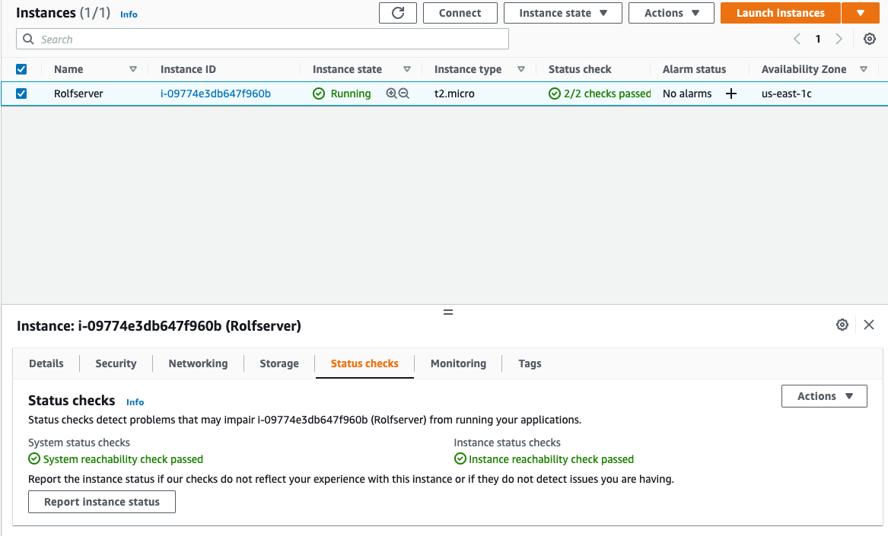

# [Elastic Compute Cloud (EC2)]

Learn how to setup a server, allow/configure acces and ports in AWS EC2
How To terminate whole proces
Learn about pricing

- On demand instances are the most expensive option, but they’re also the most flexible.
- Reserved instances provide a greater discount depending on how much you pay up front. You can reserve instances only for 1 or 3 years.
- Spot instances are generally considered the cheapest, but their availability depends on the demand, so - they’re not always reliable.

## Key terminology

**Elastic Block Store (EBS)**
Amazon's block-level storage solution used with the EC2 cloud service to store persistent data. This means that the data is kept on the AWS EBS servers even when the EC2 instances are shut down.

**Security Group service:** this makes it easer to secure/setup, you don't need a firewall. 

## Exercise
Navigate to the EC2 menu.
Launch an EC2 instance with the following requirements:
AMI: Amazon Linux 2 AMI (HVM), SSD Volume Type
Instance type: t2.micro
Default network, no preference for subnet
Termination protection: enabled
User data:
#!/bin/bash
 yum -y install httpd
systemctl enable httpd
systemctl start httpd
 echo '<html><h1>Hello From Your Web Server!</h1></html>' >   /var/www/html/index.html
Root volume: general purpose SSD, Size: 8 GiB
New Security Group:
Name: Web server SG
Rules: Allow SSH, HTTP and HTTPS from anywhere

Wait for the Status Checks to get out of the initialization stage. When you click the Status Checks tab, you should see that the System reachability and the Instance reachability checks have passed.
Log in to your EC2 instance using an ssh connection.
Terminate your instance.

### Sources
[Terminate Instance](https://docs.aws.amazon.com/AWSEC2/latest/UserGuide/terminating-instances.html#terminating-instances-console)

[EBS](https://aws.amazon.com/ebs/)

### Overcome challanges
Making the KEY chmod 400 work in SSH
Finding the field to add and modify stuff in the "new enviroment of EC2/AWS" compare to the exsercise

### Results

- exercise 1

Launch an EC2 instance with the following requirements:

Exercise 2

Wait for the Status Checks to get out of the initialization stage. 

Log in to your EC2 instance using an ssh connection.

Terminate your instance.

