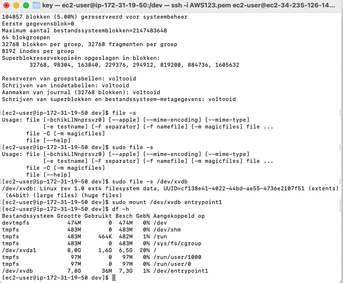
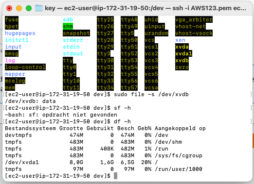
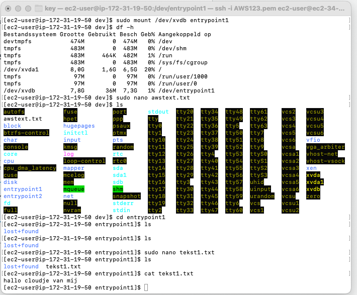
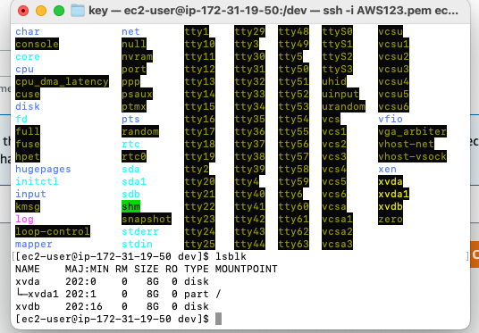
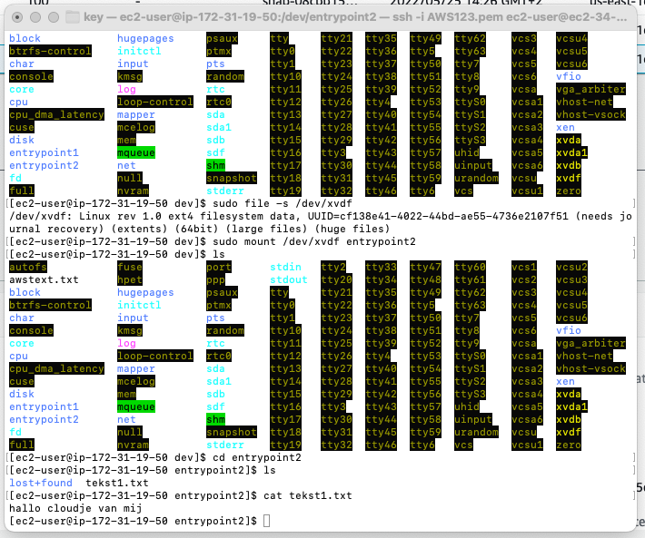
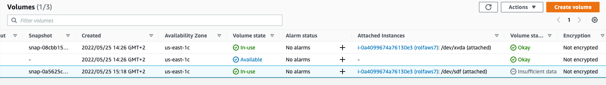

# [Elastic Block store]

Learn about EBS, how to attach volumes in EC2, mount them and create backups called snapshot

## Key terminology
Introduction:
EBS can be seen as virtual hard drives in the cloud. They can be either root volumes (like an internal hard disk), or seperate volumes (like an external hard disk). One instance of an EBS is called a volume. One volume can usually only be attached to one EC2 instance at a time, although for every non-root volume, you can detach it and attach it to a different EC2 instance. EBS Multi-Attach is only available in specific cases.

You can create snapshots of a volume to create backups or new identical volumes. These snapshots will be stored in S3.
There are four different volume types. Generally speaking, lower performance means lower cost, but newer generations or specialized hardware might give better performance for lower costs.

For security, EBS volumes can be encrypted. Volumes can be scaled up, but not down.

Any external device, including EBS, needs to be mounted if you want to use them in Linux.

## Exercise
Exercise 1
Navigate to the EC2 menu.
Create a t2.micro Amazon Linux 2 machine with all the default settings.
Create a new EBS volume with the following requirements:
Volume type: General Purpose SSD (gp3)
Size: 1 GiB
Availability Zone: same as your EC2
Wait for its state to be available.

Exercise 2
Attach your new EBS volume to your EC2 instance.
Connect to your EC2 instance using SSH.
Mount the EBS volume on your instance.
Create a text file and write it to the mounted EBS volume.

Exercise 3
Create a snapshot of your EBS volume.
Remove the text file from your original EBS volume.
Create a new volume using your snapshot.
Detach your original EBS volume.
Attach the new volume to your EC2 and mount it.
Find your text file on the new EBS volume.

### Sources

[AWStraining](https://aws.amazon.com/training/digital/?cta=tctopbanner)

Teamwork ! 
AWS website
ALso following the info you get from AWS during installation.

### Overcome challanges
Fixing acces.pem key with CHMOD 400
Understanding the link between Linux terminal and AWS EC2, found out there are many ways to adjust EC2 enviroment/virtual "disks"

### Results

**Important Commands Used:**

- LSBLK command: is used to display details about block devices and these block devices(Except ram disk) - are basically those files that represent devices connected to the pc.
- file -s command: With this command you can check the File System of a volume.
- mkfs -t ext4 command: With this command you can make/give a volume a certain file system.
- df -h command: This command list a summary of all mounted volumes and file systems, and their usage/free - space.
- File system: A Linux file system is a structured collection of files on a disk drive or a partition. A - partition is a segment of memory and contains some specific data. In our machine, there can be various - partitions of the memory. Generally, every partition contains a file system.

