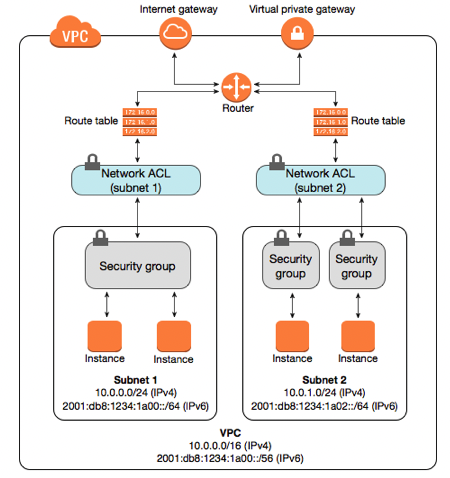

# [Security Groups]

Learn about, Network Security Groups, NCAL, Statefull and Stateless. 
What are the diffirences and where are they installen within the VPC.

## Key terminology
- Security Groups are applied at the EC2 instances level.

- Network ACLs act as a secondary layer of defense.

- Network ACLs are applied at the Subnet level. These restrict the traffic, coming in or out of the subnet. ACLs are therefore automatically applied to all resources (e.g. EC2 instances) in the subnet.

- Stateful firewalls are capable of monitoring and detecting states.

- Stateless firewalls: only focus on individual packets, using preset rules to filter traffic.

## Exercise

**Study:**
Security Groups in AWS
Network Access Control Lists in AWS

### Sources
[Layout NACL and SEC-Groups](https://harvestingclouds.com/post/azure-for-aws-professionals-networking-aws-06-network-acls-vs-security-groups/)

### Overcome challanges

Understand diffirence in configuration NCAL and Sec Groups. Alowed manual alowed default. 

### Results

Security Groups.  (Network level)
- Allow to add rules
- Anything that is not allowed, is always denied 
- 1 default rule allows all Outbound traffic. 

NACL: NETWORK ACCES CONTROL LIST .
- Extra layer of security
- A NACL has both explicit allow and deny rules, stateless firewalls.
- You allow rules manually
- You denied rules manually 

Diffirence between Security Groups and NACL

NACL is another security line next to the Securitygroup, so more safety.

