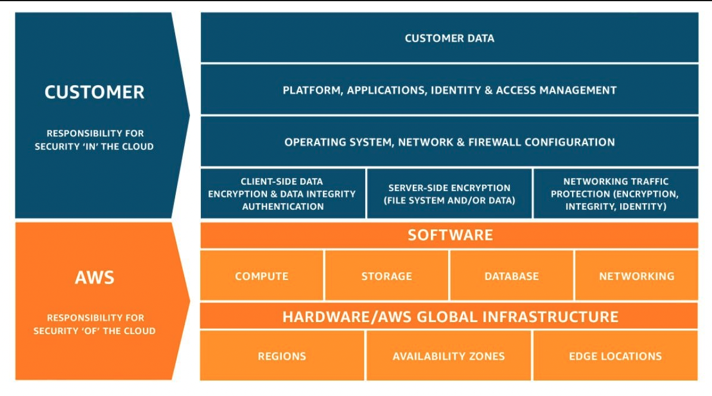

# [Shared Responsibility Model]

Introduction
The Shared Responsibility Model describes who is responsible for the security of what part of the cloud. In general, you can say that AWS is responsible for security of the cloud, while the customer is responsible for security in the cloud. AWS is always responsible for securing the physical infrastructure, while the customer is always responsible for encrypting customer data.

## Key terminology

Shared Responsibility Model: 

Simply put, the AWS Shared Responsibility Model outlines what security actions an organization is responsible for and what security actions AWS manages. 

CIS: Center For Internet Security

## Exercise

Study Shared Responsibility Model 

### Sources

[Shared Responsibility Chart](https://pages.awscloud.com/apn-tv-authority-to-operate-ep-007.html?trk=apn-tv-carousel)

[SRM explained detailed](https://aws.amazon.com/compliance/shared-responsibility-model/)

[CIS](https://pages.awscloud.com/apn-tv-authority-to-operate-ep-003.html?trk=apn-tv-carousel)

### Overcome challanges
None

### Results

**In general**
Depending on what your organization’s cloud infrastructure looks like, the responsibility of security actions varies between the cloud user and Amazon Web Services.

**Customer Responsibility**
- Customer Data is put in the cloud by the Customer, so the company has to make sure it is Encrypted.  

**AWS**
- AWS is responsible for the hardware and the Software that is offered by AWS
- Depending on software that is used, there is a shared or full responsibility for 

- AWS is responsible for security of the cloud,
- Securing the Physical infrastructure

