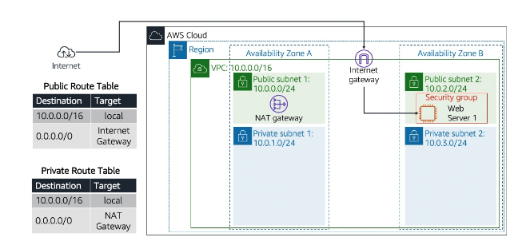
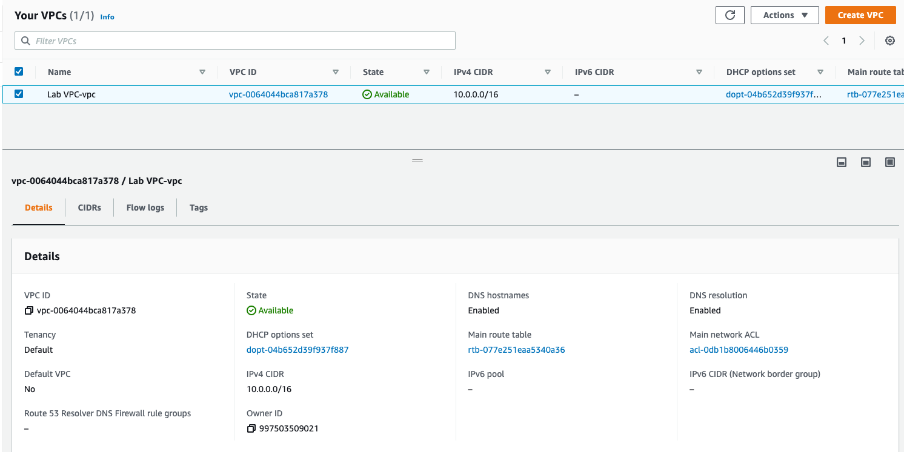
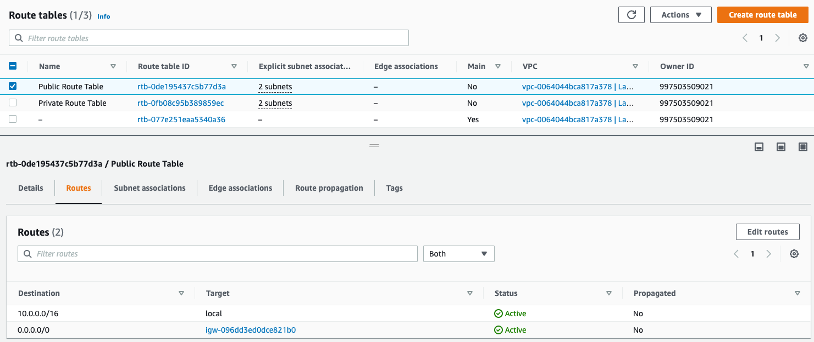
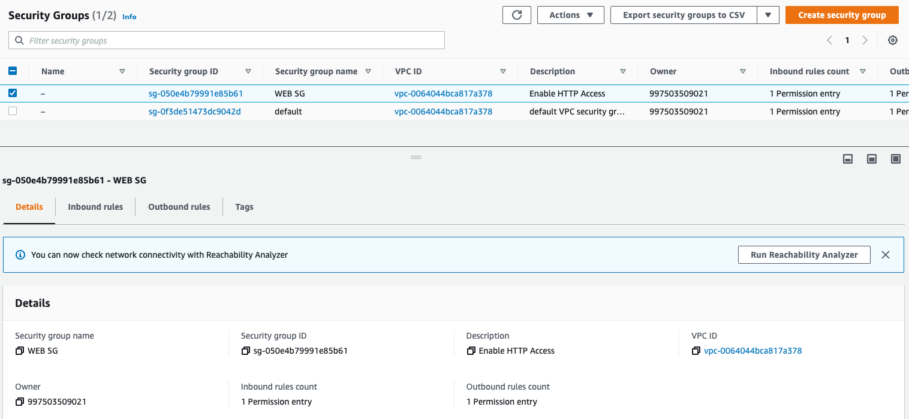
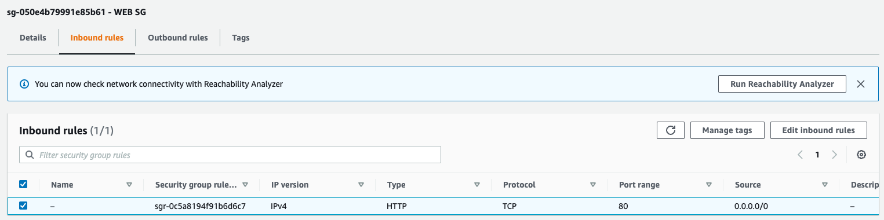
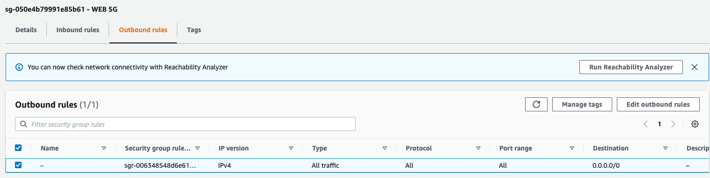
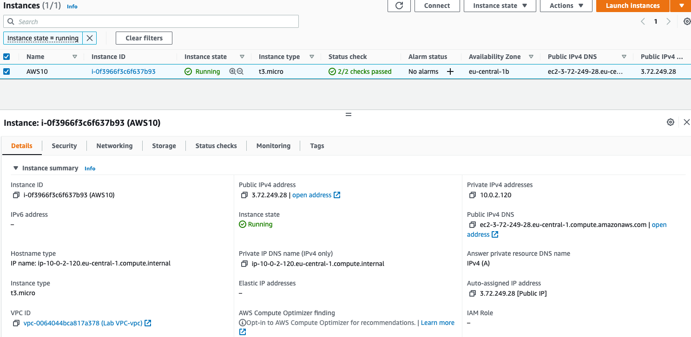
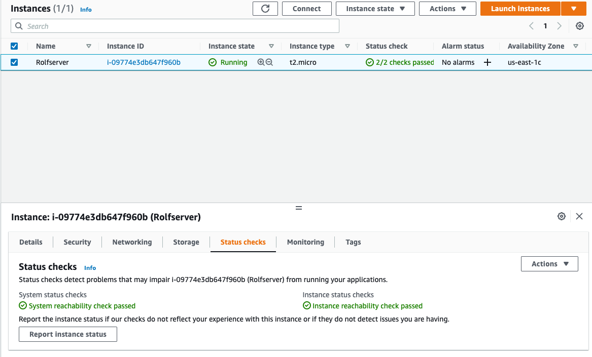

# [Virtual Private Cloud (VPC)]

## Key terminology

**Default VPC**
When you create a AWS Account you always get a Default VPC

Important Note: VPCs operate at the regional level

Whit this VPC you can create: 
- subnets: A segment of a VPC’s IP address range where you can place groups of isolated resources.
- Private Subnets: Have no entry to the Internet Gateway in their routing table. 
- Public Subnets: do have connection to the internet Gateway. 
    Subnets can olny be placed in a single Availability Zone
- IGW: Internet Gateway
- Internet Gateway: The Amazon VPC side of a connection to the public Internet.
- NAT Gateway: A highly available, managed Network Address Translation (NAT) service for your resources in a private subnet to access the Internet.
- VPN: Virtual Private Network: The Amazon VPC side of a VPN connection.
- Virtual private gateway: The Amazon VPC side of a VPN connection.
- VPC Endpoints: Enables private connectivity to services hosted in AWS, from within your VPC without using an Internet Gateway.
- Add up to 5 no-default VPC's per region. (This 5 is a soft limit: means you can ask this limit to be raised)

Many services within AWS need a VPC for example:
- EC2 Elastic Compute
- RDS Relational Database Service
- ECS Elastic Container Service

**CIDR** 
CIDR: Classless Inter-Domain Routing 

When creating a VPC you need to choose a CIDR BLOCK

In contrast to classful routing, which categorizes addresses into one of three blocks, CIDR allows for blocks of IP addresses to be allocated to Internet service providers. The blocks are then split up and assigned to the provider's customers

CIDR, which stands for Classless Inter-Domain Routing, is an IP addressing scheme that improves the allocation of IP addresses. It replaces the old system based on classes A, B, and C. This scheme also helped greatly extend the life of IPv4 as well as slow the growth of routing tables.
The CIDR number is typically preceded by a slash “/” and follows the IP address. For example, an IP address of 131.10. 55.70 with a subnet mask of 255.0. 0.0 (which has 8 network bits) would be represented as 131.10.

**Elastic IPs**
EIPs are public IP addresses that can be dynamically allocated to resources like EC2 instances or NATgateways.

## Exercise

**1**
Allocate an Elastic IP address to your account.
Use the Launch VPC Wizard option to create a new VPC with the following requirements:
Region: Frankfurt (eu-central-1)
VPC with a public and a private subnet
Name: Lab VPC
CIDR: 10.0.0.0/16
Requirements for the public subnet:
Name: Public subnet 1
CIDR: 10.0.0.0/24
AZ: eu-central-1a
Requirements for the private subnet:
Name: Private subnet 1
CIDR: 10.0.1.0/24
AZ: eu-central-1a

**2**

Create an additional public subnet without using the wizard with the following requirements:
VPC: Lab VPC
Name: Public Subnet 2
AZ: eu-central-1b
CIDR: 10.0.2.0/24
Create an additional private subnet without using the wizard with the following requirements:
VPC: Lab VPC
Name: Private Subnet 2
AZ: eu-central-1b
CIDR: 10.0.3.0/24
View the main route table for Lab VPC. It should have an entry for the NAT gateway. Rename this route table to Private Route Table.
Explicitly associate the private route table with your two private subnets.
View the other route table for Lab VPC. It should have an entry for the internet gateway. Rename this route table to Public Route Table.
Explicitly associate the public route table to your two public subnets.

**3**

Create a Security Group with the following requirements:
Name: Web SG
Description: Enable HTTP Access
VPC: Lab VPC
Inbound rule: allow HTTP access from anywhere
Outbound rule: Allow all traffic

**4**

Launch an EC2 instance with the following requirements:
AMI: Amazon Linux 2
Type: t3.micro
Subnet: Public subnet 2
Auto-assign Public IP: Enable
User data:
#!/bin/bash
# Install Apache Web Server and PHP
yum install -y httpd mysql php

# Download Lab files
wget https://aws-tc-largeobjects.s3.amazonaws.com/CUR-TF-100-RESTRT-1/80-lab-vpc-web-server/lab-app.zip
unzip lab-app.zip -d /var/www/html/

# Turn on web server
chkconfig httpd on
service httpd start
Tag:
Key: Name
Value: Web server
Security Group: Web SG
Key pair: no key pair
Connect to your server using the public IPv4 DNS name.

### Sources
For the Key Terms i used Google:

For excercises i used AWS knolledge

[ElasticIP](https://eu-central-1.console.aws.amazon.com/console/home?region=eu-central-1#)

[EC2](https://eu-central-1.console.aws.amazon.com/console/home?region=eu-central-1#)

[VPC](https://eu-central-1.console.aws.amazon.com/console/home?region=eu-central-1#)

[secGroups](https://eu-central-1.console.aws.amazon.com/console/home?region=eu-central-1#)

[subnets](https://eu-central-1.console.aws.amazon.com/console/home?region=eu-central-1#)

### Overcome challanges
Getting used to where to install what in the programs, VPC, EC2, routing, subs.. 

### Results

First picutre shows the layout of the excercise result

**1** 
Allocate an Elastic IP address to your account:

**2** 
Create an VPC with additional Public & Private Subnet 

**3** 
Create a Security Group with the following 

Inbound Rules: 

Outbound Rules:

**4**
Launch an EC2 instance

Status

Connect to your server using the public IPv4 DNS name.

