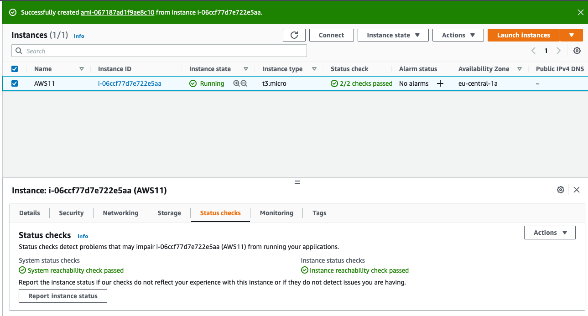
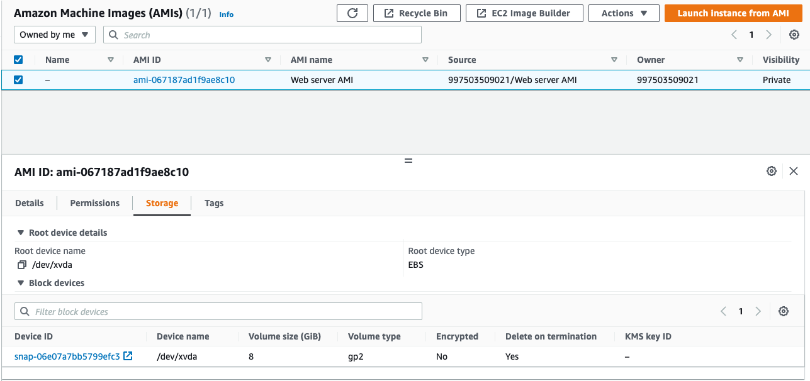
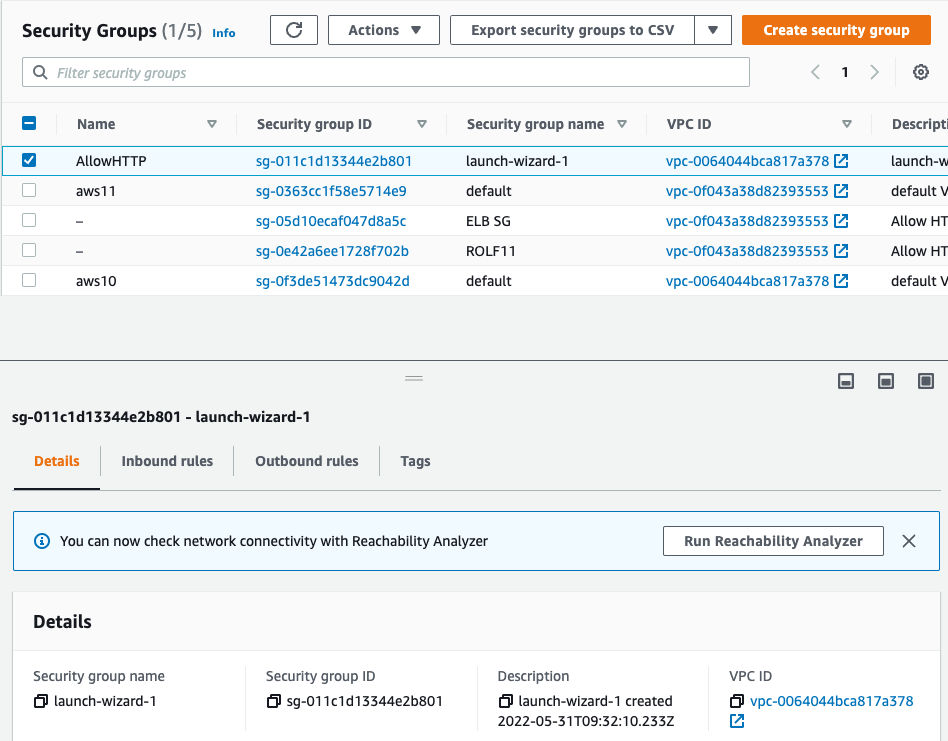
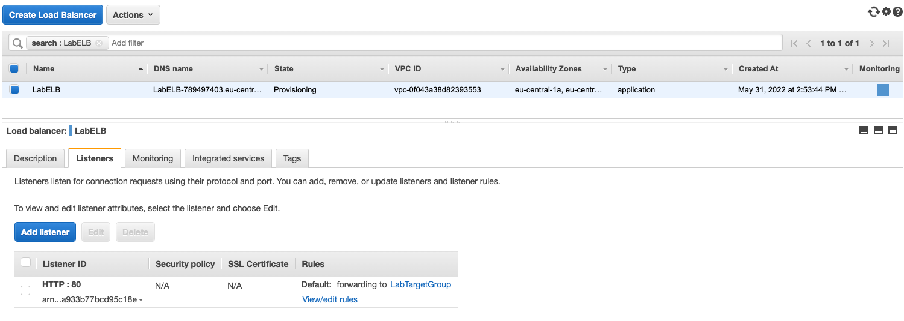
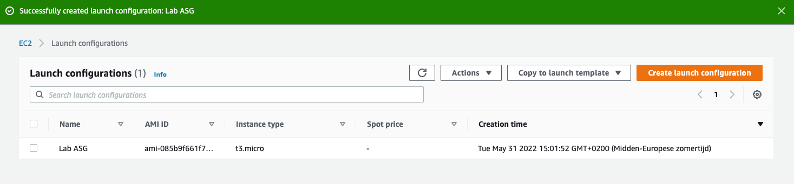
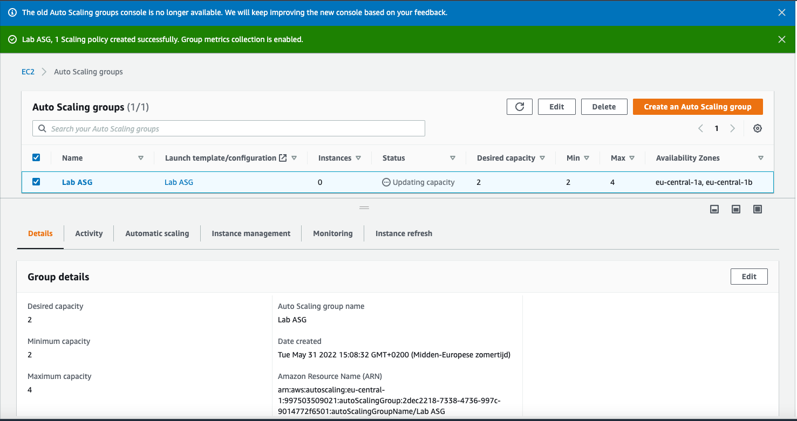
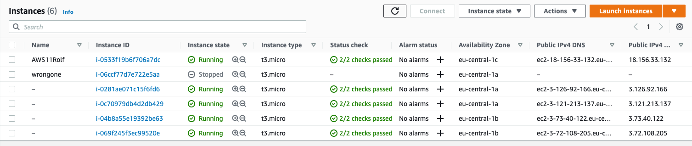

# Elastic Load Balancing (ELB) & Auto Scaling

How much capacity do we need? this was always the question. Now there is Auto Scaling, a service that automatically scales up or down with on demand systems. 

Amazon EC2 Auto Scaling helps you ensure that you have the correct number of Amazon EC2 instances.

IMA: is an Amazon Machine image that helps to create an instance, what do we need to build is in the AMI. Auto scaling uses this image. 

## Key terminology

**Auto Scaling** 

- Better fault tolerance. Amazon EC2 Auto Scaling can detect when an instance is unhealthy, terminate it, and launch an instance to replace it. You can also configure Amazon EC2 Auto Scaling to use multiple Availability Zones. If one Availability Zone becomes unavailable, Amazon EC2 Auto Scaling can launch instances in another one to compensate.

- Better availability. Amazon EC2 Auto Scaling helps ensure that your application always has the right amount of capacity to handle the current traffic demand.

- Better cost management. Amazon EC2 Auto Scaling can dynamically increase and decrease capacity as needed. Because you pay for the EC2 instances you use, you save money by launching instances when they are needed and terminating them when they aren't.

- To make sure all servers are the same, Auto Scaling makes use of a (custom) AMI. Auto Scaling makes use of CloudWatch metrics to determine whether to add or remove instances.

**AMI** 

- Amazon Machine Image
- Is a supported and maintained image provided by AWS that provides the information required to launch an instance.
- To make sure all servers are the same, Auto Scaling makes use of a (custom) AMI.

CloudWatch metrics

- A metric represents a time-ordered set of data points that are published to CloudWatch.
- For example, you can view all EC2 metrics, EC2 metrics grouped by instance, or EC2 metrics grouped by Auto Scaling group. 
- Only the AWS services that you're using send metrics to Amazon CloudWatch.

- Where is CloudWatch data stored?
CloudWatch monitors multiple EC2 machines. The logs are stored on S3 using the native CloudWatch export S3 export functionality

**Loadbalancer** ELB

Elastic Load Balancing (ELB) automatically distributes incoming application traffic across multiple targets and virtual appliances in one or more Availability Zones (AZs).

- The load balancer will forward the request to one of the servers in the fleet, and relay the response back to the client.

**Additional info**

- Application Load Balancer: this ELB works using HTTP and HTTPS protocols (layer 7 of the OSI stack).
- Network Load Balancer: this ELB works using TCP and UDP (layer 4 of the OSI stack).
- Classic Load Balancer: this ELB is outdated and not recommended for use. AWS has (so far) never stopped supporting any services. The reason for this is that it can harm existing applications.
- Gateway Load Balancer: this ELB acts as a gateway into your network, as well as a load balancer. It will first route traffic to a (3rd party) application that checks the traffic, like an IDS/IPS or Firewall. After the packet has been inspected, the GWLB acts like a NLB routing to your application. GWLB act on layers 3 and 4 of the OSI stack.

## Exercise

**Exercise 1**

Launch an EC2 instance with the following requirements:
Region: Frankfurt (eu-central-1)
AMI: Amazon Linux 2
Type: t3.micro
User data:
#!/bin/bash
# Install Apache Web Server and PHP
yum install -y httpd mysql php
# Download Lab files
wget https://aws-tc-largeobjects.s3.amazonaws.com/CUR-TF-100-RESTRT-1/80-lab-vpc-web-server/lab-app.zip
unzip lab-app.zip -d /var/www/html/
# Turn on web server
chkconfig httpd on
service httpd start
Security Group: Allow HTTP
Wait for the status checks to pass.
Create an AMI from your instance with the following requirements:
Image name: Web server AMI    

**Exercise 2**

 Create an application load balancer with the following requirements:
Name: LabELB
Listener: HTTP on port 80
AZs: eu-central-1a and eu-central-1b
Subnets: must be public
Security Group: 
Name: ELB SG
Rules: allow HTTP access
Target Group:
Name: LabTargetGroup
Targets: to be registered by Auto Scaling
  
**Exercise 3** 

Create a launch configuration for the Auto Scaling group. It has to be identical to the server that is currently running.
Create an auto scaling group with the following requirements:
Name: Lab ASG
Launch Configuration: Web server launch configuration
Subnets: must be in eu-central-1a and eu-central-1b
Load Balancer: LabELB
Group metrics collection in CloudWatch must be enabled
Group Size:
Desired Capacity: 2
Minimum Capacity: 2
Maximum Capacity: 4
Scaling policy: Target tracking with a target of 60% average CPU utilisation

**Exercise 4**

Verify that the EC2 instances are online and that they are part of the target group for the load balancer.
Access the server via the ELB by using the DNS name of the ELB.
Perform a load test on your server(s) using the website on your server to activate auto scaling. There might be a delay on the creation of new servers in your fleet, depending on the settings on your Auto Scaling Group.

### Sources

[autoscaling](https://docs.aws.amazon.com/autoscaling/ec2/userguide/auto-scaling-benefits.html)

[AMI](https://www.google.com/search?q=ami+aws&oq=ami+aws&aqs=chrome.0.0i512l5j69i60l3.2169j0j7&sourceid=chrome&ie=UTF-8)

[cloudwatchmetrics](https://www.google.com/search?q=cloudwatch+metrics&ei=BdqVYp6UIprKlAb62rqQBQ&ved=0ahUKEwjeqv3vsIn4AhUaJcUKHXqtDlIQ4dUDCA4&uact=5&oq=cloudwatch+metrics&gs_lcp=Cgdnd3Mtd2l6EAMyBAgAEEMyBQgAEIAEMgUIABCABDIFCAAQgAQyBQgAEIAEMgUIABCABDIFCAAQgAQyBQgAEIAEMgUIABCABDIFCAAQgAQ6BwgAEEcQsAM6BwgAELADEENKBAhBGABKBAhGGABQY1hjYIEIaAFwAXgAgAE6iAE6kgEBMZgBAKABAcgBCcABAQ&sclient=gws-wiz)

[loadbalanceELB](https://aws.amazon.com/elasticloadbalancing/)

### Overcome challanges
None

### Results

**Exercise 1**

Launch an EC2 instance

Create AMI

Make Securitygroup before loadbalancer can be made. 

Create LoadBalancer

**3**

- Create a launch configuration for the Auto Scaling group. 

Create Autoscaling

**4**

- Verify that the EC2 instances are online and that they are part of the target group for the load balancer.
- Access the server via the ELB by using the DNS name of the ELB.
- Perform a load test on your server(s) using the website on your server to activate auto scaling. There might be a delay on the creation of new servers in your fleet, depending on the settings on your Auto Scaling Group.

Results: 

