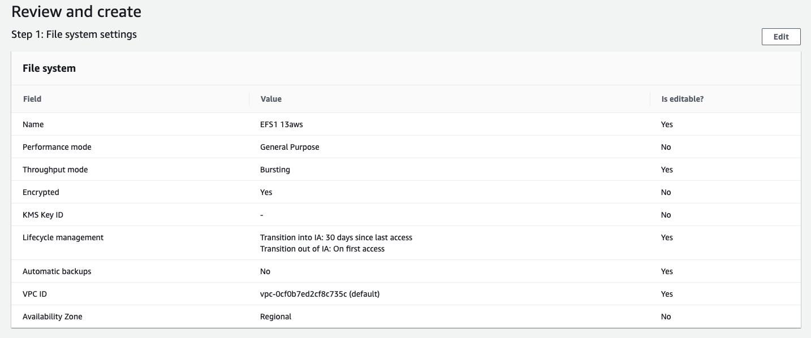
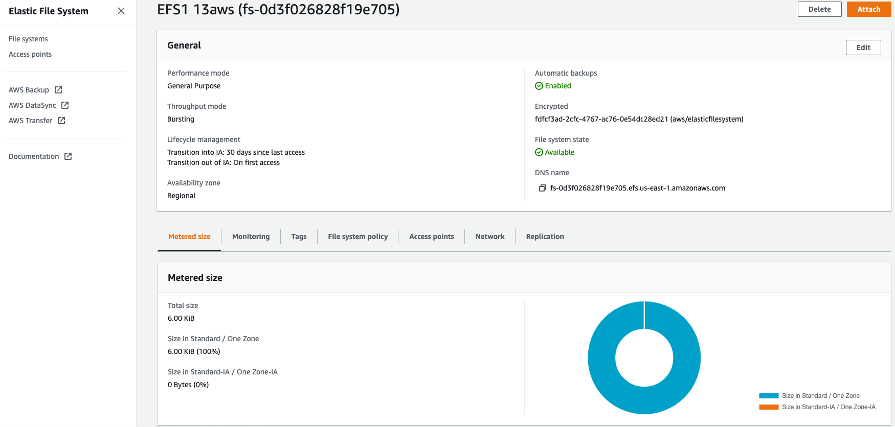
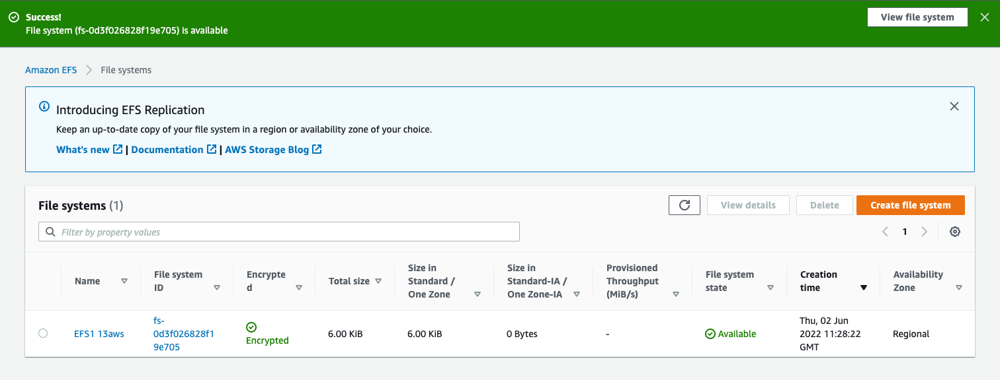
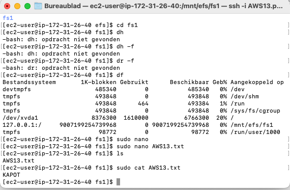
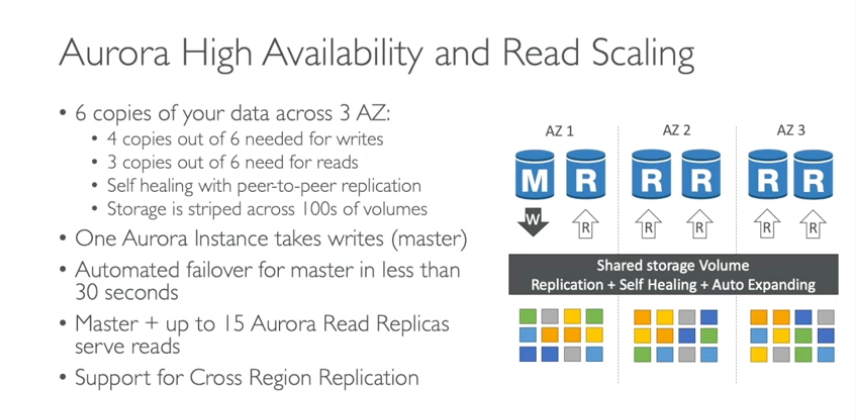
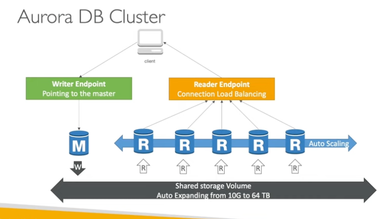
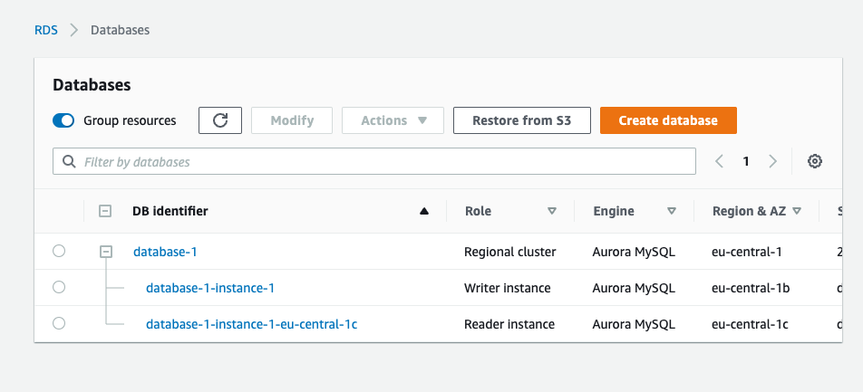

# Files, AppServices, CDN, DNS, Database

Study and learn practicall things on ur own, where to find them, and how to install. 

ALso find diffirences between the appl. compare them. 

1. What is "subject" for?
2. What does "subject" replace compared to how it was done before?
3. Can i and how to combine "subject" with other services?
4. What is "subject" for?
5. What is the difference between "subject" and other similar services

Een handige lijst van taken die je praktisch moet kunnen:
Waar kan ik deze dienst vinden in de console?
Hoe zet ik deze dienst aan?
Hoe kan ik deze dienst koppelen aan andere resources?

## Key terminology

**Elastic Beanstalk** 

1. What is "subject" for?
2. What does "subject" replace compared to how it was done before?
3. Can i and how to combine "subject" with other services?
4. What is "subject" for?
5. What is the difference between "subject" and other similar services

With AWS Elastic Beanstalk, you can quickly deploy and manage applications in the AWS Cloud without worrying about the infrastructure that runs those applications. 

- You simply upload your applications.
Examples: Docker, Python, PHP, Node.js, .NET, Ruby, or Java.
 
AWS Elastic Beanstalk automatically handles the details:
- capacity provisioning
- load balancing
- scaling
- application health monitoring.

**CloudFront** CDN

1. What is "subject" for?
2. What does "subject" replace compared to how it was done before?
3. Can i and how to combine "subject" with other services?
4. What is "subject" for?
5. What is the difference between "subject" and other similar services

Amazon CloudFront is a web service that gives businesses and web application developers an easy and cost effective way to distribute content with low latency and high data transfer speeds.

Amazon CloudFront provides a simple API that lets you:
- Distribute content with low latency (fast dielivery of content)
- high data transfer rates by serving requests using a network of edge locations around the world.
- Get started without negotiating contracts and minimum commitments.

Key Notations Cloudfront
- Routing
- Edge locations (caches the content)
- More availability

**Route53**
1. What is "subject" for?
2. What does "subject" replace compared to how it was done before?
3. Can i and how to combine "subject" with other services?
4. What is "subject" for?
5. What is the difference between "subject" and other similar services

- Highly reliable
Ensures a consistent ability to route applications
- Scalable
Automatically handles large queries without the users interactions
- Easy to use
Easy to configure DNS settings and provides fast response to queries
- Cost effective
pay only for the service used
- Secure
the user secures the acces rights by integrating route53 with AWS-IAM. 

**EFS**

1. What is "EFS" for?

Amazon elastic File system
system on an Amazon EC2 instance, and then read and write data to and from your file system. You can mount an Amazon EFS file system in your virtual private cloud (VPC), through the Network File System versions 4.0 and 4.1 (NFSv4) protocol. 

2. What does "subject" replace compared to how it was done before?
3. Can i and how to combine "subject" with other services?
4. What is "subject" for?
5. What is the difference between "subject" and other similar services

**Regional** to create a file system that uses Standard storage classes. Standard storage classes store file system data and metadata redundantly across all Availability Zones within an AWS Region. Regional offers the highest levels of availability and durability.

**One Zone** to create a file system that uses One Zone storage classes. One Zone storage classes store file sytem data and metadata redundantly within a single Availability Zone which makes it less expensive than Standard storage classes.

Because EFS One Zone storage classes store data in a single AWS Availability Zone, data stored in these storage classes may be lost in the event of a disaster or other fault that affects all copies of the data within the Availability Zone, or in the event of Availability Zone destruction resulting from disasters, such as earthquakes and floods.

**RDS** & **Aurora**

1. What is RDS for?
 
- Amazon RDS is a PaaS as it only provides a platform or a set of tools to manage your database instances. AWS is Iaas, but the RDS provided by the AWS is PaaS.
- Amazon Relational Database Service (RDS) is a managed SQL database service provided by Amazon Web Services (AWS). 
- Amazon RDS supports an array of database engines to store and organize data. It also helps with relational database management tasks, such as data migration, backup, recovery and patching.

2. What does "RDS" replace compared to how it was done before?

- What is the difference between RDS and EC2?
RDS offers Provisioned IOPS or PIOPS to achieve fast, predictable, and consistent Input/Output performance. EC2 allows you to meet unique performance, replication, archival or DR requirements by giving you the required flexibility. You can choose the EBS (SSD) volume as per the your need.

- Is RDS same as S3?
While S3 is strongly consistent, its consistency is limited to single storage operations. On the other hand, RDS supports transactions that allow one to execute a series of operations while maintaining consistency and even providing an option to roll back the operations in case of the steps go wrong.

3. Can i and how to combine "RDS" with other services?

While setting up RDS you may choose: Aurora, MySQL, MariaDB, PostgreSQL, Oracle, MicrosoftSQL (SQL-server)

4. What is "RDS" for?

Amazon RDS helps organizations handle relational database management tasks such as migration, backup, recovery and patching. Some of the main features of Amazon RDS are replication, high performance storage and failure detection. One of the biggest advantages of Amazon RDS is its ease of use.

5. What is the difference between "RDS" and other similar services

Amazon rds provides an HTTP endpoint to run SQL statements on an Amazon Aurora Serverless DB cluster. To run these statements, you work with the Data Service API. Amazon RDS is a PaaS as it only provides a platform or a set of tools to manage your database instances. AWS is Iaas, but the RDS provided by the AWS is PaaS.

**Aurora**

1. What is "Aurora" for?

Image result for What is Aurora aws
Amazon Aurora is a relational database management system (RDBMS) built for the cloud with full MySQL and PostgreSQL compatibility. 

2. What does "subject" replace compared to how it was done before?
Aurora gives you the performance and availability of commercial-grade databases at one-tenth the cost.

3. Can i and how to combine "subject" with other services?
4. What is "subject" for?
5. What is the difference between "subject" and other similar services

The Amazon RDS Data Service API contains several data types that various actions use. 

- ArrayValue
- ColumnMetadata
- Field
- Record
- ResultFrame
- ResultSetMetadata
- ResultSetOptions
- SqlParameter
- SqlStatementResult
- StructValue
- UpdateResult
- Value

## Exercise

Handige vragen die je in gedachten kan (/moet) houden tijdens je onderzoek naar de onderwerpen:
Waar is X voor?
Hoe past X / vervangt X in een klassieke setting?
Hoe kan ik X combineren met andere diensten?
Wat is het verschil tussen X en andere gelijksoortige diensten?

Een handige lijst van taken die je praktisch moet kunnen:
Waar kan ik deze dienst vinden in de console?
Hoe zet ik deze dienst aan?
Hoe kan ik deze dienst koppelen aan andere resources?

### Sources

[Introduction to AWS Elastic Beanstalk](https://www.youtube.com/watch?v=SrwxAScdyT0)

[toturial Beanstalk](https://www.youtube.com/watch?v=96DJ2Og90hU)

[Cloudfront](https://www.youtube.com/watch?v=sQNONcj0cvc)

[Route53](https://www.youtube.com/watch?v=BtiS0QyiTK8)

[EFS](https://us-east-1.console.aws.amazon.com/efs?region=us-east-1#/get-started)

[RDS/AURORA](https://www.youtube.com/watch?v=vw5EO5Jz8-8)

### Overcome challanges
Understand the positions of all the apllications. 

### Results

**create EFS**

**RDS and Aurora**

**results**

Create DB
