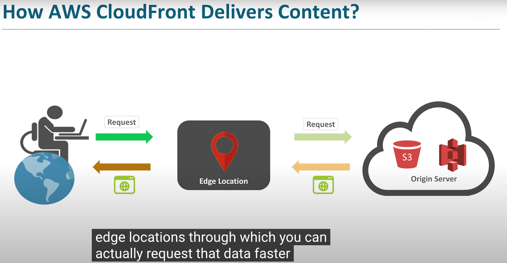
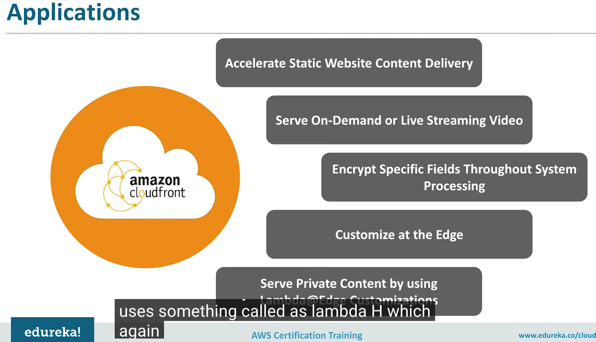
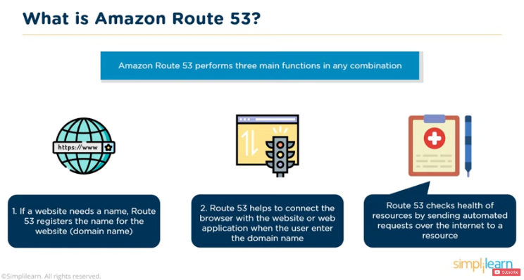

# [Files, AppServices, CDN, DNS, Database]

Study and learn practicall things on ur own: 

Handige vragen die je in gedachten kan (/moet) houden tijdens je onderzoek naar de onderwerpen:
Waar is X voor?
Hoe past X / vervangt X in een klassieke setting?
Hoe kan ik X combineren met andere diensten?
Wat is het verschil tussen X en andere gelijksoortige diensten?

Een handige lijst van taken die je praktisch moet kunnen:
Waar kan ik deze dienst vinden in de console?
Hoe zet ik deze dienst aan?
Hoe kan ik deze dienst koppelen aan andere resources?

## Key terminology

**Elastic Beanstalk** 
With AWS Elastic Beanstalk, you can quickly deploy and manage applications in the AWS Cloud without worrying about the infrastructure that runs those applications. 

- You simply upload your applications.
Examples: Docker, Python, PHP, Node.js, .NET, Ruby, or Java.
 
AWS Elastic Beanstalk automatically handles the details:
- capacity provisioning
- load balancing
- scaling
- application health monitoring.

**CloudFront** CDN

Amazon CloudFront is a web service that gives businesses and web application developers an easy and cost effective way to distribute content with low latency and high data transfer speeds.

Amazon CloudFront provides a simple API that lets you:
- Distribute content with low latency (fast dielivery of content)
- high data transfer rates by serving requests using a network of edge locations around the world.
- Get started without negotiating contracts and minimum commitments.

Key Notations Cloudfront
- Routing
- Edge locations (caches the content)
- More availability

**Route53**

- Highly reliable
Ensures a consistent ability to route applications
- Scalable
Automatically handles large queries without the users interactions
- Easy to use
Easy to configure DNS settings and provides fast response to queries
- Cost effective
pay only for the service used
- Secure
the user secures the acces rights by integrating route53 with AWS-IAM. 

Way's of Routing: 

- simple routing policy

DNS 1 to 1 : webserver to website

**Failover Routing**

When something failes you want to failover to another resource, ships the traffic to the healty resource. Anything from a bucket S3

**Geolocation Routing**

Looks at locations, country's
A user from France you want to sent to the French website, Others maybe to the English website. 
It localized content on:
- Continent level
- Geographic level
- State level (only in U.S.) 

**EFS**

Amazon elastic File system
system on an Amazon EC2 instance, and then read and write data to and from your file system. You can mount an Amazon EFS file system in your virtual private cloud (VPC), through the Network File System versions 4.0 and 4.1 (NFSv4) protocol. We recommend using a current generation Linux NFSv4.1 client, such as those found in the latest Amazon Linux, Amazon Linux 2, Red Hat, Ubuntu, and macOS Big Sur AMIs, in conjunction with the Amazon EFS mount helper

**Regional** to create a file system that uses Standard storage classes. Standard storage classes store file system data and metadata redundantly across all Availability Zones within an AWS Region. Regional offers the highest levels of availability and durability.

**One Zone** to create a file system that uses One Zone storage classes. One Zone storage classes store file sytem data and metadata redundantly within a single Availability Zone which makes it less expensive than Standard storage classes.

Because EFS One Zone storage classes store data in a single AWS Availability Zone, data stored in these storage classes may be lost in the event of a disaster or other fault that affects all copies of the data within the Availability Zone, or in the event of Availability Zone destruction resulting from disasters, such as earthquakes and floods.

**RDS** & **Aurora**

Amazon rds provides an HTTP endpoint to run SQL statements on an Amazon Aurora Serverless DB cluster. To run these statements, you work with the Data Service API.

**Aurora**
The Amazon RDS Data Service API contains several data types that various actions use. 

- ArrayValue
- ColumnMetadata
- Field
- Record
- ResultFrame
- ResultSetMetadata
- ResultSetOptions
- SqlParameter
- SqlStatementResult
- StructValue
- UpdateResult
- Value

## Exercise

Create EFS

### Sources

[Introduction to AWS Elastic Beanstalk](https://www.youtube.com/watch?v=SrwxAScdyT0)

[toturial Beanstalk](https://www.youtube.com/watch?v=96DJ2Og90hU)

[Cloudfront](https://www.youtube.com/watch?v=sQNONcj0cvc)

[Route53](https://www.youtube.com/watch?v=BtiS0QyiTK8)

[EFS](https://us-east-1.console.aws.amazon.com/efs?region=us-east-1#/get-started)

[RDS/AURORA](https://www.youtube.com/watch?v=vw5EO5Jz8-8)

### Overcome challanges
Understand the positions of all the apllications. 

### Results

