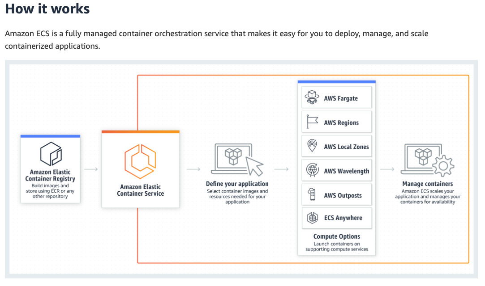
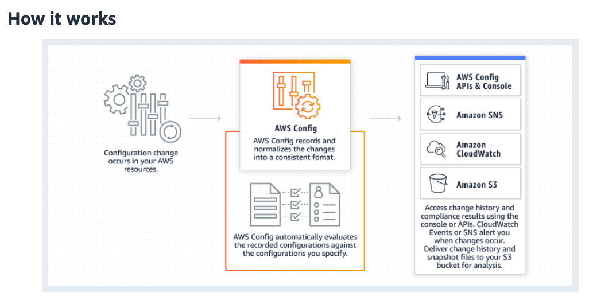

# [ECS, AWS Support Plans, Trusted Advisor]

Learn about the Support plans and there diffirences, What is Elastic Container Service, Trusted Advisory, AWS config and Cloud Trail. 

## Exercise study: 

**ECS**
Amazon Elastic Container Service:
Run highly secure, reliable, and scalable containers

-  Launch thousands of containers across the cloud using your preferred continuous integration and delivery (CI/CD) and automation tools.
- Optimize your time with AWS Fargate serverless compute for containers, which eliminates the need to configure and manage control plane, nodes, and instances.
- Save up to 50 percent on compute costs with autonomous provisioning, auto-scaling, and pay-as-you-go pricing.
- Integrate seamlessly with AWS management and governance solutions, standardized for
compliance with virtually every regulatory agency around the globe.

Deploy in a hybrid environment:
- Build container-based applications on-premises or in the cloud with Amazon ECS Anywhere and enjoy consistent tooling, management, workload scheduling, and monitoring across environments.

Support batch processing: 
- Plan, schedule, and execute batch computing workloads across the full range of AWS services, including Amazon Elastic Compute Cloud (EC2), Fargate, and Amazon EC2 Spot Instances.

Scale web applications:
- Automatically scale and run web applications in multiple Availability Zones with the performance, scale, reliability, and availability of AWS.

**AWS Support Plans**

Why a support plan? 
- Move faster with AWS
- Automate management of your environment
- Focus on what matters
- Manage and mitigate risks
- Highly-trained engineers, large network of subject-matter experts
- Engineers empowered to help you achieve your goals

Types of Support: 

**Developer Support**

We recommend AWS Developer Support if you are testing or doing early development on AWS and want the ability to get technical support during business hours as well as general architectural guidance as you build and test.

Includes: 

- Enhanced technical support
Business hours email access to Cloud Support engineers. You can have one primary contact that can open an unlimited amount of cases. Response times for general guidance is less than 24 business hours* and system impaired is less than 12 business hours*.

- Architectural support
General guidance on how to use AWS products, features, and services together. AWS Solutions Architects leverage the AWS Well-Architected framework when providing recommendations.

- Customer service and communities
24x7 access to customer service, documentation, whitepapers, and support forums.

**Business support**

We recommend AWS Business Support if you are running production workloads on AWS and want 24x7 access to technical support from engineers, access to Health API, and contextual architectural guidance for your use-cases.

Includes: 
- Enhanced technical support
24x7 access to Cloud Support Engineers via phone, chat, and email. You can have an unlimited number of contacts that can open an unlimited amount of cases. Response times for general guidance is less than 24 hours, system impaired is less than 12 hours, production system impaired is less than 4 hours, and production system down is less than an hour.

- Third-party software support
Guidance, configuration, and troubleshooting of AWS interoperability with many common operating systems, platforms, and application stack components.

- Customer service and communities
24x7 access to customer service, documentation, whitepapers, and support forums.

**Enterprise On-Ramp**

We recommend Enterprise On-Ramp if you have production/business critical workloads in AWS and want 24x7 access to technical support from engineers, access to Health API, consultative architectural guidance, and a pool of Technical Account Managers (TAMs) to coordinate access to AWS subject matter experts.

Includes:
- Enhanced technical support
24x7 access to Cloud Support Engineers via phone, chat, and email. You can have an unlimited number of contacts that can open an unlimited amount of cases. Response times for general guidance is less than 24 hours, system impaired is less than 12 hours, production system impaired is less than 4 hours, production system down is less than an hour, and business critical system down is less than 30 minutes

- Billing and account management
AWS billing and account experts specialize in working with enterprise accounts. They will quickly and efficiently assist you with your billing and account inquiries, and work with you to implement billing and account best practices so that you can focus on what matters: running your business.

- Third-party software support
Guidance, configuration, and troubleshooting of AWS interoperability with many common operating systems, platforms, and application stack components.

- A pool of Technical Account Managers
A pool of Technical Account Managers helps you onboard, provides advocacy and guidance to help plan and build solutions using best practices, coordinates access to subject matter experts, assists with case management, and presents insights and recommendations on your AWS spend, workload optimization, and event management, which proactively keeps your AWS environment healthy.

- Access to subject matter experts
Cloud Support Engineers, Solutions Architects, and product teams are available to provide guidance and help as needed. The AWS Trust & Safety team assists you when your AWS resources are used to engage in abusive behaviors, such as spam, port scanning, denial-of-service (DoS) attacks, or malware

**Enterprice**
We recommend Enterprise Support for 24x7 technical support from high-quality engineers, tools and technology to automatically manage health of your environment, consultative architectural guidance, and a designated Technical Account Manager (TAM) to coordinate access to proactive / preventative programs and AWS subject matter experts.

- Enhanced technical support
24x7 access to Cloud Support Engineers via phone, chat, and email. You can have an unlimited number of contacts that can open an unlimited amount of cases. Response times for general guidance is less than 24 hours, system impaired is less than 12 hours, production system impaired is less than 4 hours, production system down is less than an hour, and business critical system down is less than 15 minutes.

- Billing and account management
AWS billing and account experts specialize in working with enterprise accounts. They will quickly and efficiently assist you with your billing and account inquiries, and work with you to implement billing and account best practices so that you can focus on what matters: running your business.

- Third-party software support
Guidance, configuration, and troubleshooting of AWS interoperability with many common operating systems, platforms, and application stack components.

- Technical account management
Designated point of contact
A Technical Account Manager (TAM) is your designated technical point of contact who helps you onboard, provides advocacy and guidance to help plan and build solutions using best practices, coordinates access to subject matter experts, assists with case management, presents insights and recommendations on your AWS spend, workload optimization, and event management, and proactively keeps your AWS environment healthy.

- Access to subject matter experts
Cloud Support Engineers, Solutions Architects, Technical Account Managers, and product teams are available to provide guidance and help as needed. The AWS Trust & Safety team assists you when your AWS resources are used to engage in abusive behaviors, such as spam, port scanning, denial-of-service (DoS) attacks, or malware.

[importantsheet](https://aws.amazon.com/premiumsupport/plans/)

**Trusted Advisor**

AWS Trusted Advisor provides recommendations that help you follow AWS best practices.

 Trusted Advisor evaluates your account by using checks. These checks identify ways to optimize your AWS infrastructure, improve security and performance, reduce costs, and monitor service quotas. You can then follow the check recommendations to optimize your services and resources.

It depends on the Support-type you choose what options are included.

- AWS Basic Support and AWS Developer Support customers can access core security checks and all checks for service quotas.

- AWS Business Support and AWS Enterprise Support customers can access all checks, including cost optimization, security, fault tolerance, performance, and service quotas. For a complete list of checks and descriptions, see the Trusted Advisor Best Practices.

- Cost optimization
Trusted Advisor can help you save cost with actionable recommendations by analyzing usage, configuration and spend. Examples include identifying idle RDS DB instances, underutilized EBS volumes, unassociated Elastic IP addresses, and excessive timeouts in Lambda functions.

- Performance
Trusted Advisor can help improve the performance of your services with actionable recommendations by analyzing usage and configuration. Examples include analyzing EBS throughput and latency, compute usage of EC2 instances, and configurations on CloudFront.

- Security
Trusted Advisor can help improve the security of your AWS environment by suggesting foundational security best practices curated by security experts. Examples include identifying RDS security group access risk, exposed access keys, and unnecessary S3 bucket permissions.

- Fault tolerance
Trusted Advisor can help improve the reliability of your services. Examples include examining Auto scaling EC2 groups, deleted health checks on Route 53, disabled Availability Zones, and disabled RDS backups.

- Service quotas/limits
Service quotas are the maximum number of resources that you can create in an AWS account.  AWS implements quotas to provide highly available and reliable service to all customers, and protects you from unintentional spend. Trusted Advisor will notify you once you reach more than 80% of a service quota. You can then follow recommendations to delete resources or request a quota increase.

**AWS Config**

AWS Config is a service that enables you to assess, audit, and evaluate the configurations of your AWS resources. Config continuously monitors and records your AWS resource configurations and allows you to automate the evaluation of recorded configurations against desired configurations. With Config, you can review changes in configurations and relationships between AWS resources, dive into detailed resource configuration histories, and determine your overall compliance against the configurations specified in your internal guidelines. This enables you to simplify compliance auditing, security analysis, change management, and operational troubleshooting.

- Continuous monitoring
With AWS Config, you are able to continuously monitor and record configuration changes of your AWS resources. Config also enables you to inventory your AWS resources, the configurations of your AWS resources, as well as software configurations within EC2 instances at any point in time. Once change from a previous state is detected, an Amazon Simple Notification Service (SNS) notification can be delivered for you to review and take action.

- Continuous assessment
AWS Config allows you to continuously audit and assess the overall compliance of your AWS resource configurations with your organization’s policies and guidelines. AWS Config provides you with the ability to define rules for provisioning and configuring AWS resources. These rules can be provisioned independently or packaged together with compliance remediation actions inside a pack (known as a conformance pack) that can be deployed across your entire organization with a single click. Resource configurations or configuration changes that deviate from your rules automatically trigger Amazon Simple Notification Service (SNS) notifications and Amazon CloudWatch events so that you can be alerted on a continuous basis. You can also take advantage of the visual dashboard to check your overall compliance status and quickly spot non-compliant resources.

- Change management
With AWS Config, you are able to track the relationships among resources and review resource dependencies prior to making changes. Once a change occurs, you are able to quickly review the history of the resource's configuration and determine what the resource’s configuration looked like at any point in the past. Config provides you with information to assess how a change to a resource configuration would affect your other resources, which minimizes the impact of change-related incidents.

- Operational troubleshooting
With AWS Config, you can capture a comprehensive history of your AWS resource configuration changes to simplify troubleshooting of your operational issues. Config helps you identify the root cause of operational issues through its integration with AWS CloudTrail, a service that records events related to API calls for your account. Config leverages CloudTrail records to correlate configuration changes to particular events in your account. You can obtain the details of the event API call that invoked the change (e.g., who made the request, at what time, and from which IP address) from the CloudTrail logs.

- Enterprise-wide compliance monitoring
With multi-account, multi-region data aggregation in AWS Config, you can view compliance status across your enterprise and identify non-compliant accounts. You can dive deeper to view status for a specific region or a specific account across regions. You can view this data from the Config console in a central account, removing the need to retrieve this information individually from each account, and each region.

- Support for third-party resources
AWS Config is designed to be your primary tool to perform configuration audit and compliance verification of both your AWS and third-party resources. You can publish the configuration of third-party resources such as GitHub repositories, Microsoft Active Directory resources, or any on-premises server into AWS. You can then view and monitor the resource inventory and configuration history using the AWS Config console and APIs, just like you do for AWS resources. You can also create AWS Config rules or conformance packs to evaluate these third-party resources against best practices, internal policies, and regulatory policies.

**AWS Cloud Trail**

### Sources

[ECS](https://aws.amazon.com/ecs/)

[supportplans](https://aws.amazon.com/premiumsupport/)

[trustedAdvisor](https://aws.amazon.com/premiumsupport/technology/trusted-advisor/)

[AWSconfig](https://aws.amazon.com/config/)

[AWScloudtrail](https://aws.amazon.com/cloudtrail/)

### Overcome challanges
[Give a short description of your challanges you encountered, and how you solved them.]

### Results
NVT