# [Subject]
Learn about: 

IAM
AWS Cloudwatch
DynamoDB
AWS Lambda
SNS, SQS, Event Bridge 

Try options in AWS CONSOLE

## Key terminology

**IAM**
Identity Acces Management

- Use the Least Privilege model for the users!
- AWS Identity and Access Management (IAM) provides fine-grained access control across all of AWS. 
- With IAM, you can specify who can access which services and resources, and under which conditions. -
- With IAM policies, you manage permissions to your workforce and systems to ensure least-privilege permissions.
- IAM is an AWS service that is offered at no additional charge.

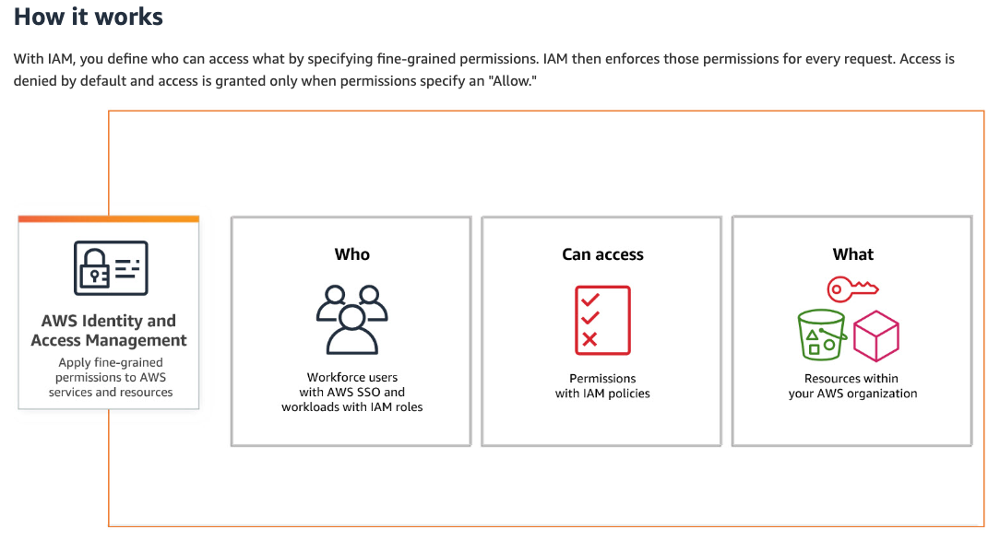

- Fine-grained access control
Permissions let you specify and control access to AWS services and resources. To grant permissions to IAM roles, you can attach a policy that specifies the type of access, the actions that can be performed, and the resources on which the actions can be performed.

Using IAM policies, you grant access to specific AWS service APIs and resources. You also can define specific conditions in which access is granted, such as granting access to identities from a specific AWS organization or access through a specific AWS service. 

- Delegate access by using IAM roles
With IAM roles you delegate access to users or AWS services to operate within your AWS account. Users from your identity provider or AWS services can assume a role to obtain temporary security credentials that can be used to make an AWS request in the account of the IAM role. Consequently, IAM roles provide a way to rely on short-term credentials for users, workloads, and AWS services that need to perform actions in your AWS accounts.

- IAM Access Analyzer
Achieving least privilege is a continuous cycle to grant the right fine-grained permissions as your requirements evolve. IAM Access Analyzer helps you streamline permissions management as you set, verify, and refine permissions.

- Permissions guardrails
With AWS Organizations, you can use service control policies (SCPs) to establish permissions guardrails that all IAM users and roles in an organization’s accounts adhere to. Whether you’re just getting started with SCPs or have existing SCPs, you can use IAM access advisor to help you restrict permissions confidently across your AWS organization.

**AWS Cloudwatch**

- CloudWatch collects monitoring and operational data in the form of logs, metrics, and events, and visualizes it using automated dashboards so you can get a unified view of your AWS resources, applications, and services that run on AWS and on premises.

- You can visualize the experience of your application end users and validate design choices through experimentation. 
- Correlate your metrics and logs to better understand the health and performance of your resources. Create alarms based on metric value thresholds you specify, or alarms that can watch for anomalous metric behavior based on ML algorithms. 
- For example, set up automated actions to notify you if an alarm is triggered and automatically start auto scaling to help reduce mean time to resolution (MTTR). 
- You can also dive deep and analyze your metrics, logs, and traces to better understand how to improve application performance.

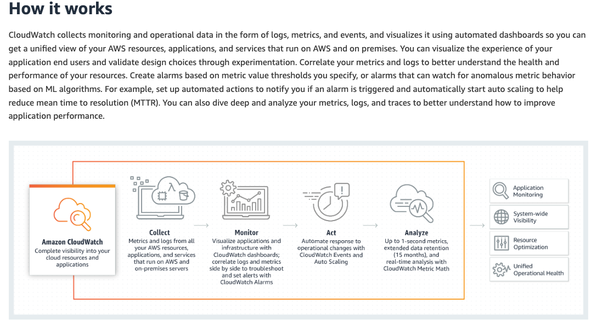

**DynamoDB**

**AWS Lambda**

**SNS, SQS, Event Bridge**

## Exercise

### Sources

[AIM](https://www.youtube.com/watch?v=y8cbKJAo3B4)

[cloudwatch](https://aws.amazon.com/cloudwatch/)

### Overcome challanges
None

### Results

**IAM**

Create Users
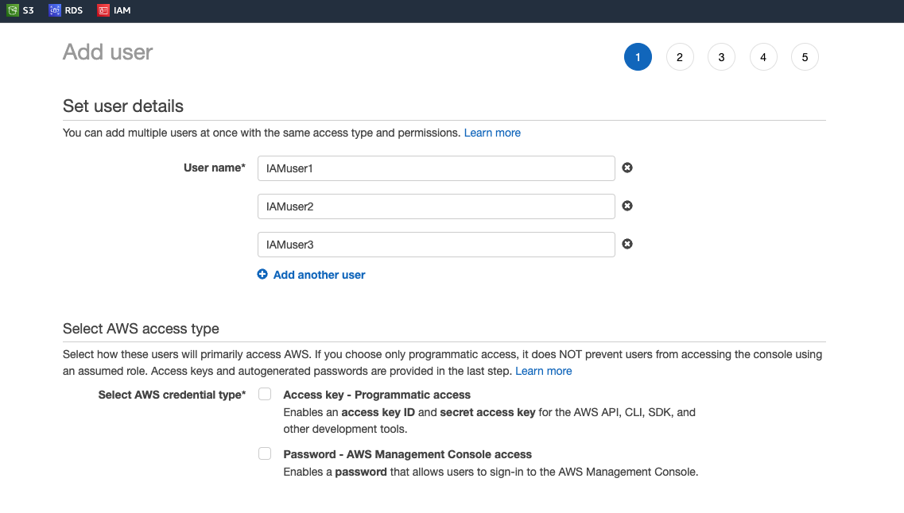
Create Group
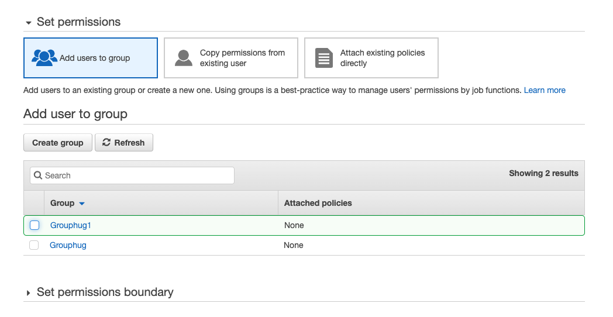
Created User in Group+keys
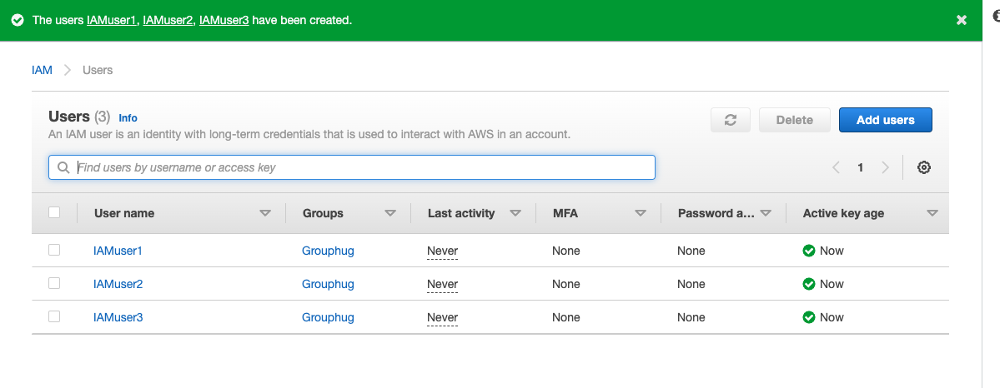
IAM dashboard Overview
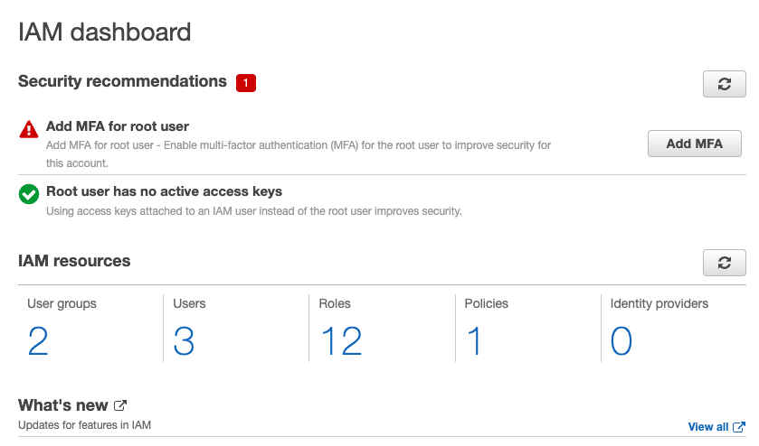

**AWS Cloudwatch**

Create Clouddwatch dashboard
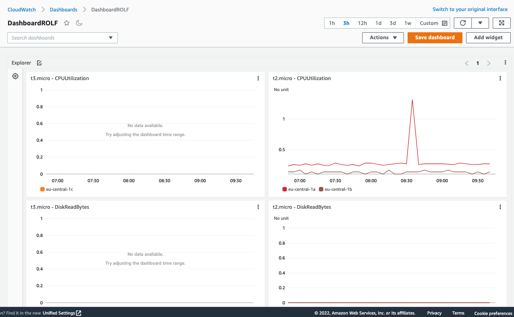
Create / choose Metric graph
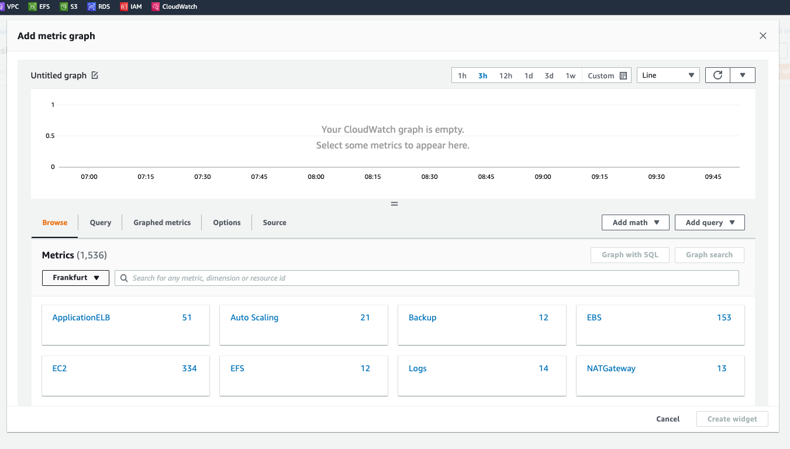
Create Alarm
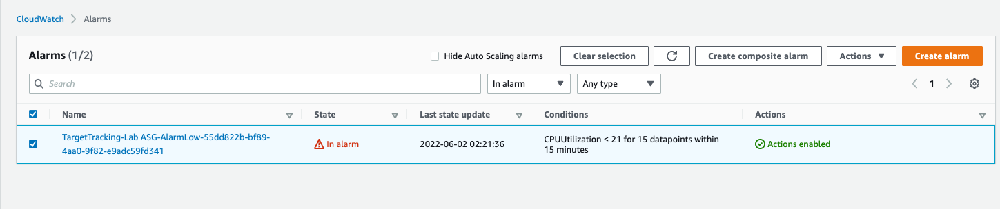
Setup Alarm
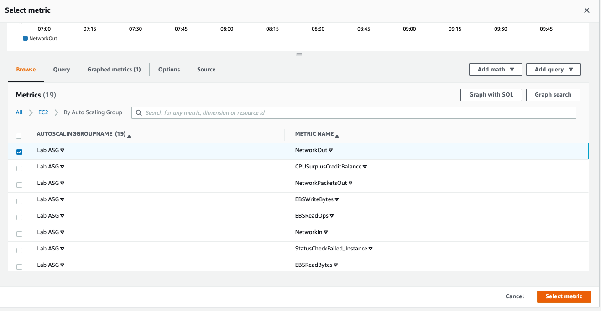
Matric & Conditions

Setup Alarm and Action
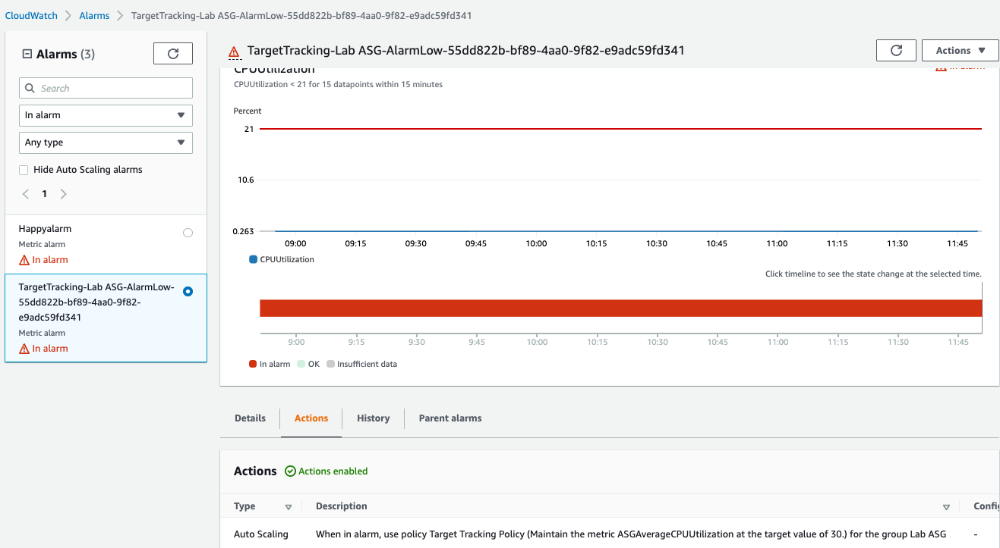
Metrix Monitoring CPUUtilization
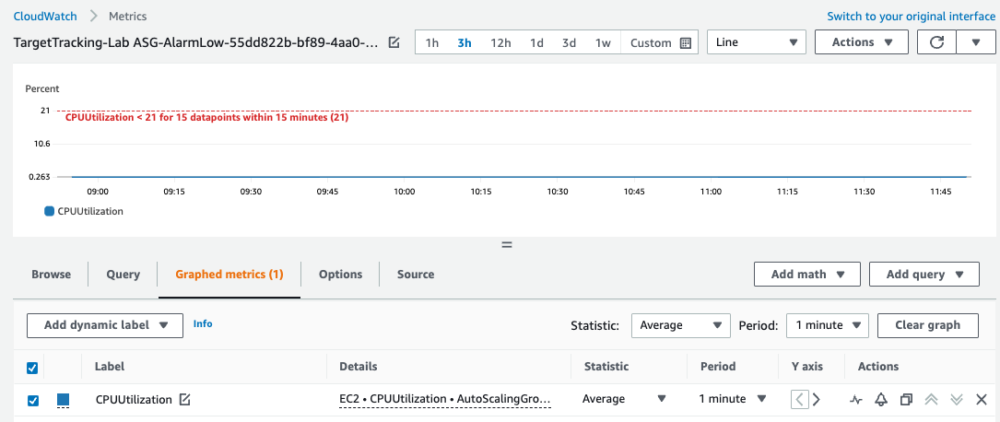
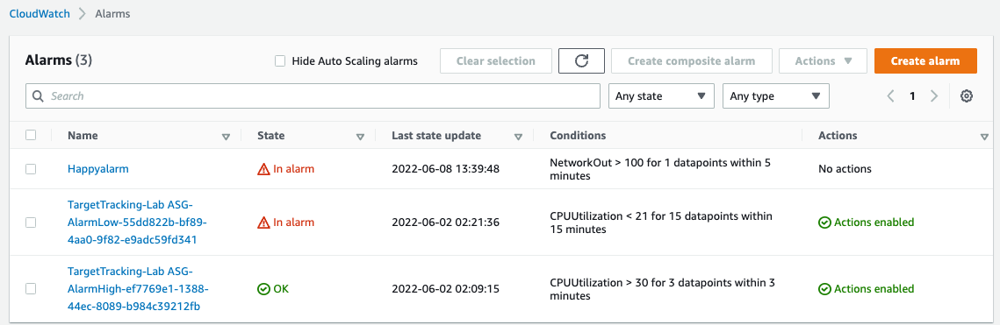

DynamoDB
AWS Lambda
SNS, SQS, Event Bridge
