# IAM AWS Cloudwatch DynamoDB AWS Lambda SNS, SQS, Event Bridge

Learn about: 

IAM
AWS Cloudwatch
DynamoDB
AWS Lambda
SNS, SQS, Event Bridge 

Try options in AWS CONSOLE

## Key terminology

**IAM**
Identity Acces Management

- Use the Least Privilege model for the users!
- AWS Identity and Access Management (IAM) provides fine-grained access control across all of AWS. 
- With IAM, you can specify who can access which services and resources, and under which conditions. -
- With IAM policies, you manage permissions to your workforce and systems to ensure least-privilege permissions.
- IAM is an AWS service that is offered at no additional charge.

- Fine-grained access control
Permissions let you specify and control access to AWS services and resources. To grant permissions to IAM roles, you can attach a policy that specifies the type of access, the actions that can be performed, and the resources on which the actions can be performed.

Using IAM policies, you grant access to specific AWS service APIs and resources. You also can define specific conditions in which access is granted, such as granting access to identities from a specific AWS organization or access through a specific AWS service. 

- Delegate access by using IAM roles
With IAM roles you delegate access to users or AWS services to operate within your AWS account. Users from your identity provider or AWS services can assume a role to obtain temporary security credentials that can be used to make an AWS request in the account of the IAM role. Consequently, IAM roles provide a way to rely on short-term credentials for users, workloads, and AWS services that need to perform actions in your AWS accounts.

- IAM Access Analyzer
Achieving least privilege is a continuous cycle to grant the right fine-grained permissions as your requirements evolve. IAM Access Analyzer helps you streamline permissions management as you set, verify, and refine permissions.

- Permissions guardrails
With AWS Organizations, you can use service control policies (SCPs) to establish permissions guardrails that all IAM users and roles in an organization’s accounts adhere to. Whether you’re just getting started with SCPs or have existing SCPs, you can use IAM access advisor to help you restrict permissions confidently across your AWS organization.

**AWS Cloudwatch**

- CloudWatch collects monitoring and operational data in the form of logs, metrics, and events, and visualizes it using automated dashboards so you can get a unified view of your AWS resources, applications, and services that run on AWS and on premises.

- You can visualize the experience of your application end users and validate design choices through experimentation. 
- Correlate your metrics and logs to better understand the health and performance of your resources. Create alarms based on metric value thresholds you specify, or alarms that can watch for anomalous metric behavior based on ML algorithms. 
- For example, set up automated actions to notify you if an alarm is triggered and automatically start auto scaling to help reduce mean time to resolution (MTTR). 
- You can also dive deep and analyze your metrics, logs, and traces to better understand how to improve application performance.

**DynamoDB**

A fast and flexible NoSQL "DB" DataBase service for any scale

- Is a Managed NoSQL (Not only SQL) Database optimized for performance at Scale
- High Availability & Durability
- Ideal for applications with "known acces Patterns" 
- Acces through API's / ORM's authorized throught IAM.
- DynamoDB integreates very well with other AWS services
- Cost effective usage based payment model

- Export data from DynamoDB to Amazon Simple Storage Service (Amazon S3) and use other AWS services such as Amazon Athena to analyze your data and extract actionable insights.
- AWS Pricing Calculator now supports DynamoDB.
- Restore DynamoDB tables even faster.
- Use Amazon Kinesis Data Streams to capture item-level changes in your DynamoDB tables.
- Use PartiQL, a SQL-compatible query language, to query, insert, update, and delete table data in DynamoDB.
- AWS Glue Elastic Views supports DynamoDB as a source to combine and replicate data continuously across multiple databases in near real-time.

SQL:    Relational Database
NoSQL: None Relational Database
NoSQL means "Not Only" SQL

**AWS Lambda**

AWS Lambda is a serverless, event-driven compute service that lets you run code for virtually any type of application or backend service without provisioning or managing servers. 

You can trigger Lambda from over 200 AWS services and software as a service (SaaS) applications, and only pay for what you use.

- Run code without provisioning or managing infrastructure. Simply write and upload code as a .zip file or container image.
CODES: Node JS, Java seashark, Go & Python. 
- Automatically respond to code execution requests at any scale, from a dozen events per day to hundreds of thousands per second.
- Save costs by paying only for the compute time you use—by per-millisecond—instead of provisioning infrastructure upfront for peak capacity.
- Optimize code execution time and performance with the right function memory size. Respond to high demand in double-digit milliseconds with Provisioned Concurrency.

Key product features:

- Extend other AWS services with custom logic
- Build custom backend services
- Bring your own code
- Completely automated administration
- Built-in fault tolerance
- Package and deploy functions as container images
- Automatic scaling
- Connect to relational databases
- Fine-grained control over performance
- Connect to shared file systems
- Run code in response to Amazon CloudFront requests
- Orchestrate multiple functions
- Integrated security model
- Trust and integrity controls
- Only pay for what you use
- Flexible resource model
- Integrate Lambda with your favorite operational tools
- Achieve up to 34% better price performance with functions powered by Graviton2

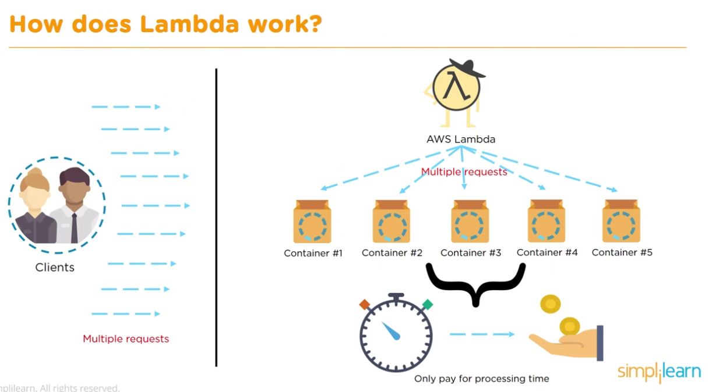

**SNS**

Simple Notification Service

Amazon Simple Notification Service (Amazon SNS) is a fully managed messaging service for:

- application-to-application (A2A) 
- application-to-person (A2P)

The A2A pub/sub functionality provides topics for high-throughput, push-based, many-to-many messaging between distributed systems, microservices, and event-driven serverless applications. 
Using Amazon SNS topics, your publisher systems can fanout messages to a large number of subscriber systems, including Amazon SQS queues, AWS Lambda functions, HTTPS endpoints, and Amazon Kinesis Data Firehose, for parallel processing. The A2P functionality enables you to send messages to users at scale via SMS, mobile push, and email.

Benefits
- Simplify and reduce costs with message filtering and batching
- Ensure accuracy with message ordering and deduplication
- Increase security with message encryption and privacy
- Increase durability with message archiving, delivery retries, and DLQ
- Capture and fan out events from AWS services
- Send A2P notifications via SMS, mobile push, and email

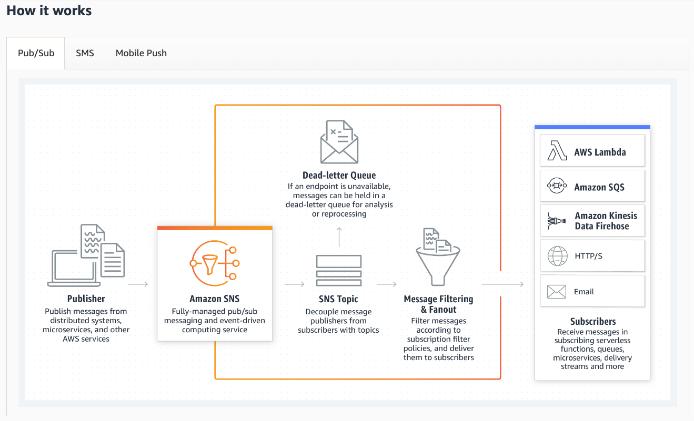
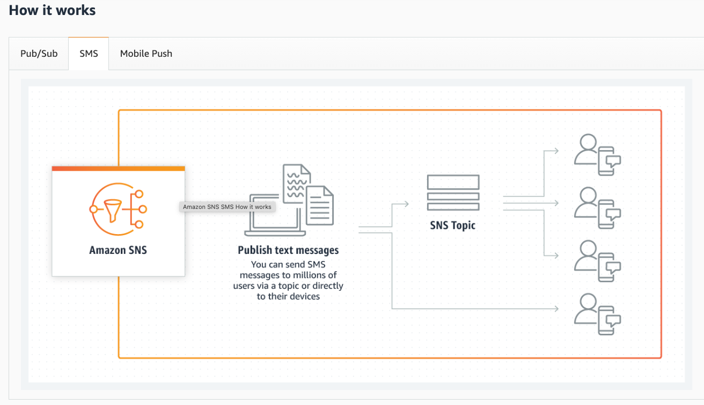
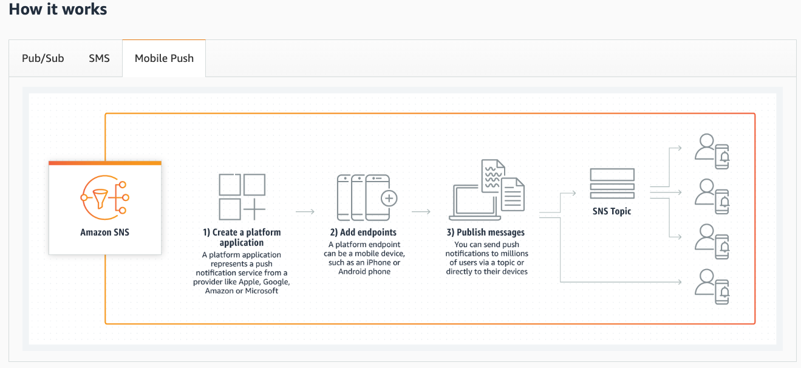

**SQS**

Simple Que Service
Amazon SQS provides queues for high-throughput, system-to-system messaging. 
You can use queues to decouple heavyweight processes and to buffer and batch work. Amazon SQS stores messages until microservices and serverless applications process them.

SQS over API, uses a Middleman, can resend Queue's 

Benefits and features SQS

- Highly scalable Standard and FIFO queues
Queues scale elastically with your application. Nearly unlimited throughput and no limit to the number of messages per queue in Standard queues. First-In-First-Out delivery and exactly once processing in FIFO queues.

- Durability and availability
Your queues are distributed on multiple servers. Redundant infrastructure provides highly concurrent access to messages.

- Security
Protection in transit and at rest. Transmit sensitive data in encrypted queues. Send messages in a Virtual Private Cloud.

- Batching
Send, receive, or delete messages in batches of up to 10 messages or 256KB to save costs.

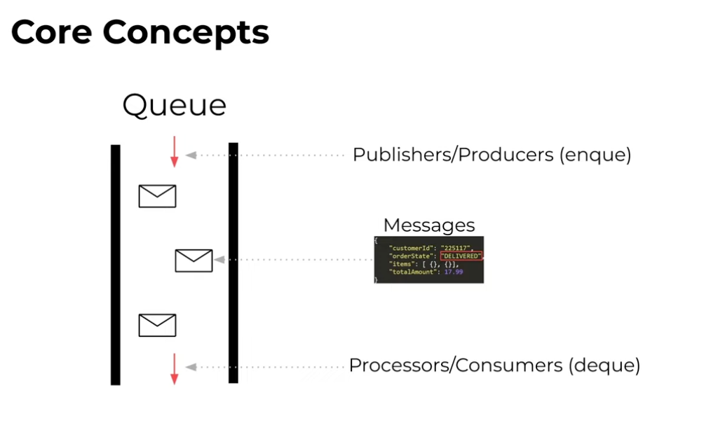

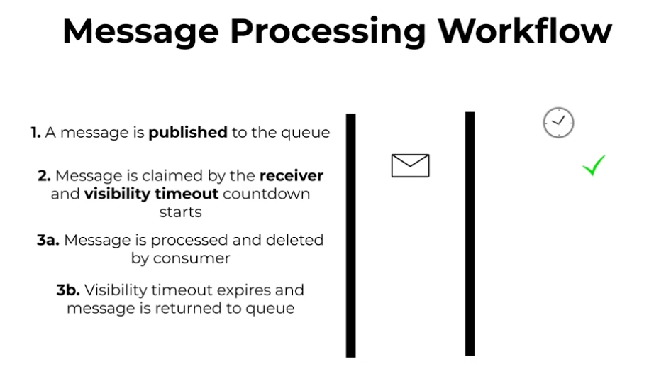

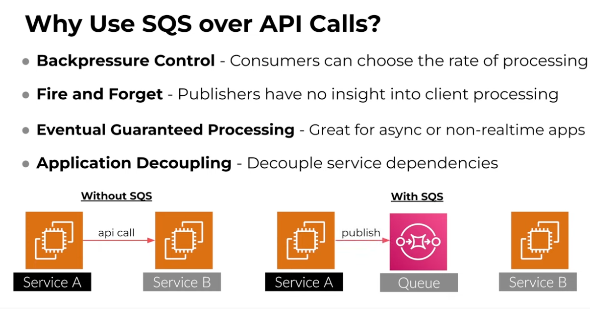

**Event Bridge**

Amazon EventBridge is a serverless event bus that makes it easier to build event-driven applications at scale using events generated from your applications, integrated Software-as-a-Service (SaaS) applications, and AWS services.

When you use Event Bridge
- You want to publish messages to many subscribers, and use the event data itself to match targets interested certain patterns.
- Want integration with other SaaS providers such as Shopify, Datadog, Pagerduty, or others.

Benefits: 

- Build event-driven architectures
EventBridge simplifies the process of building event-driven architectures. With EventBridge, your event targets don’t need to be aware of event sources because you can filter and publish directly to EventBridge. There is no setup required. Improve developer agility as well as application resiliency with loosely coupled event-driven architectures.

- Connect SaaS apps
EventBridge ingests data from supported SaaS applications and routes it to AWS services and SaaS targets (through API destinations - an HTTP invocation endpoint target for events) without writing custom integration code. You can use EventBridge to connect your SaaS apps, or use events from your SaaS apps to trigger workflows.

- Write less custom code
EventBridge makes it easier to connect applications. You can ingest, filter, transform and deliver events without writing custom code. The EventBridge schema registry stores a collection of easy-to-find event schemas and enables you to download code bindings for those schemas in your IDE so you can represent the event as a strongly-typed object in your code. Automatically add schemas discovered from your event bus to the registry through the schema discovery feature.

- Reduce operational overhead
With EventBridge, there are no servers to provision, patch, and manage. EventBridge automatically scales based on the number of events ingested, and you pay only for events published by your AWS or SaaS applications. EventBridge has built-in distributed availability, fault-tolerance and a native event archive and replay capability that makes it easier to recover from failures or build a new application state from old events.

- Message Bus – Message Buses are very similar to SNS topics in that they receive events that need to be broadcaster to downstream consumers

- Events – Events are similar to messages in the context of SNS and SQS, just with a fancier name. They consist of JSON blobs that describes the source and payload of the event. Events can also be “scheduled” to run at periodic intervals using a cron expression. This is useful for those of you looking to perform timed batch jobs regularly at a certain time of day.

- Targets – Targets are the downstream recipient of events that are published to the message bus. Very similar to SNS consumers.

- Rules – Rules are the routing logic component for Message Buses. Essentially, you can configure rules such that only when a certain condition is met (within the message data itself), will a message be broadcaster to a specific target.

- An Event Pattern is something that you define that matches the content of the message to a specific target. You can have many rules that all match to different patterns, but only 5 targets per rule. If you’d like to have more, you would need to create a new rule with the same event pattern, but with different configured targets.

SQS, SNS, and Eventbridge are three message orchestration services offered through AWS. 
Although having somewhat similar names, each of these services provides very different functionalities.

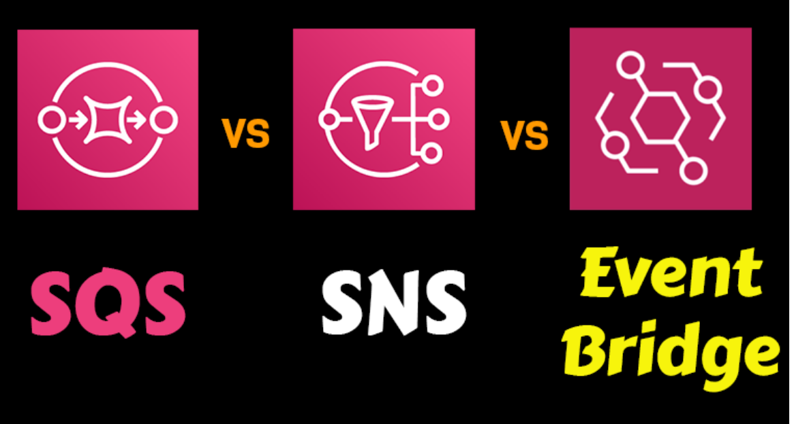

## Exercise

### Sources

[AIM](https://www.youtube.com/watch?v=y8cbKJAo3B4)

[cloudwatch](https://aws.amazon.com/cloudwatch/)

[dynamoDB](https://www.youtube.com/watch?v=2k2GINpO308) 

[lambda explained](https://www.youtube.com/watch?v=97q30JjEq9Y)

[Lambdatheory](https://aws.amazon.com/lambda/)

[SNS-theory](https://aws.amazon.com/sns/?whats-new-cards.sort-by=item.additionalFields.postDateTime&whats-new-cards.sort-order=desc)

[SNStoSQS](https://www.youtube.com/watch?v=bktTomENEX8)

[[SQS](https://www.youtube.com/watch?v=CyYZ3adwboc)

[EventBriddge](https://eu-central-1.console.aws.amazon.com/events/home?region=eu-central-1#/)

### Overcome challanges 
None

### Results

**IAM**

Create Users

Create Group

Created User in Group+keys

IAM dashboard Overview

**AWS Cloudwatch**

Create Clouddwatch dashboard

Create / choose Metric graph

Create Alarm

Setup Alarm

Matric & Conditions

Setup Alarm and Action

Metrix Monitoring CPUUtilization.

**DynamoDB**

A fast and flexible NoSQL "DB" DataBase service for any scale

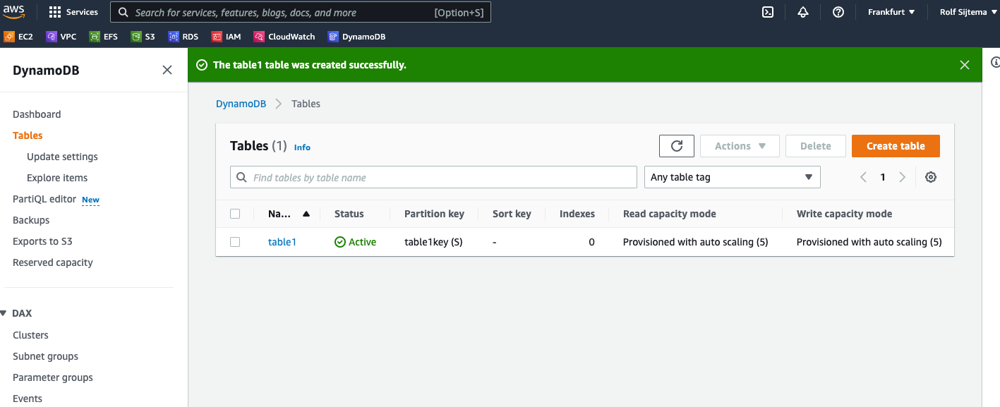

After creating Table you can monitor ur tables
also possible with Cloudwatch
set alarms etc.. 
TTL: time to life tables... 
Make replica's
Make backups Point in Time Recocery

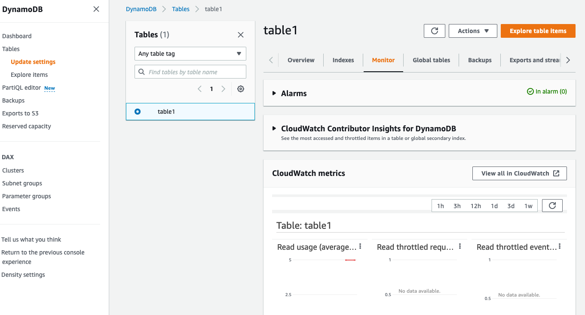

You can create Items with value's

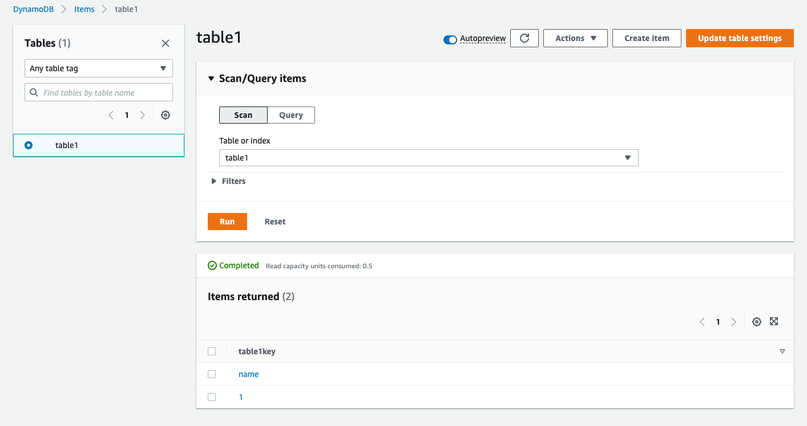

**AWS Lambda**

**SNS** 

**SQS**  

**Event Bridge**

